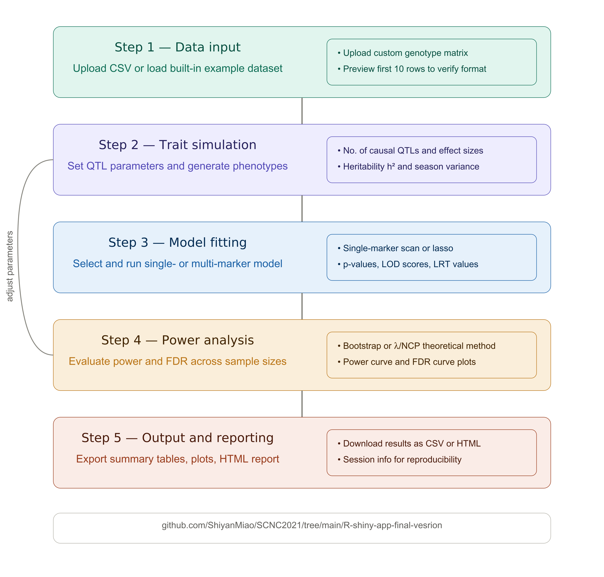
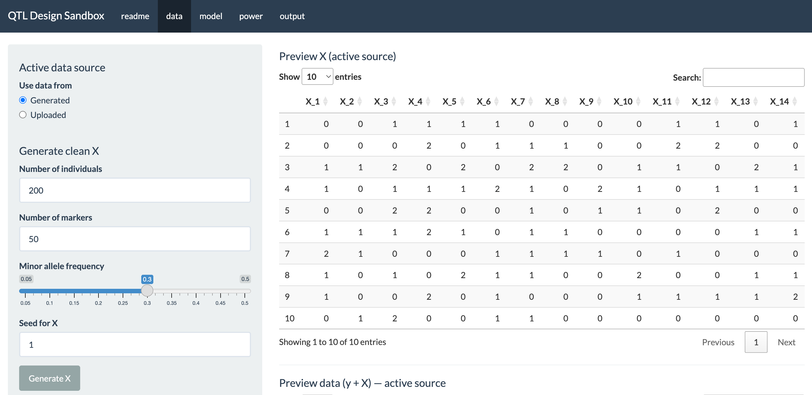
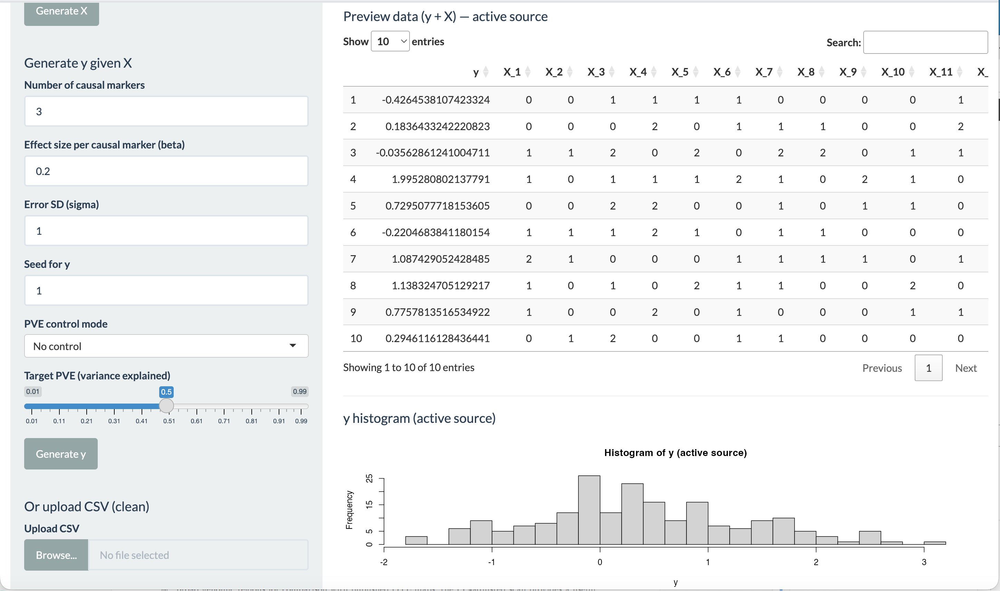
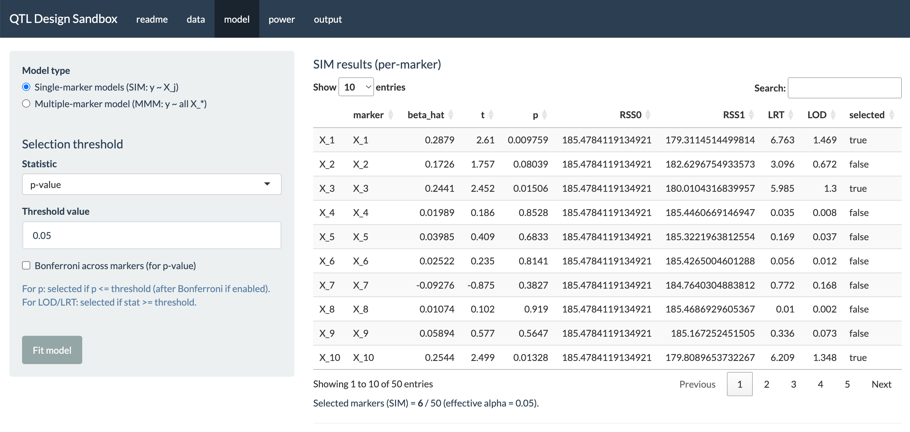
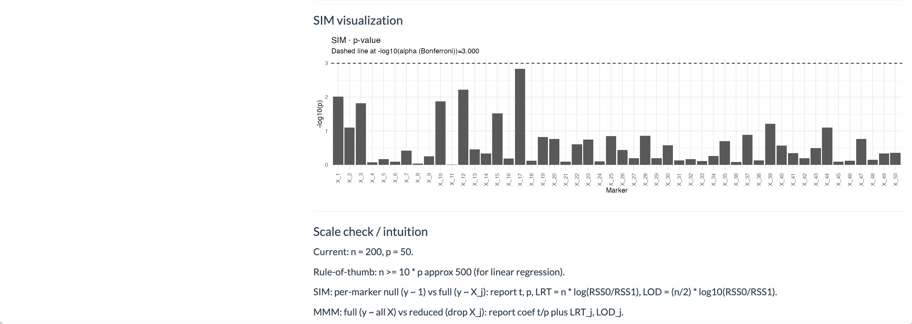
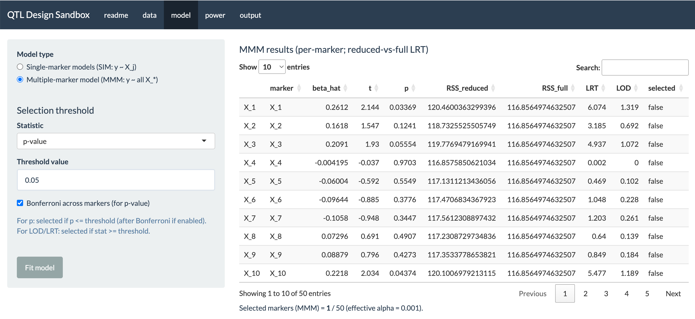
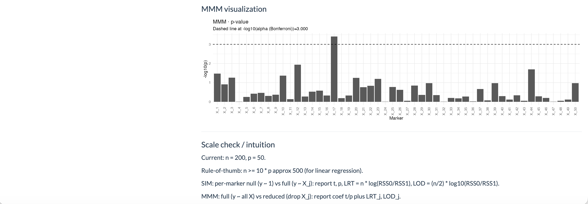
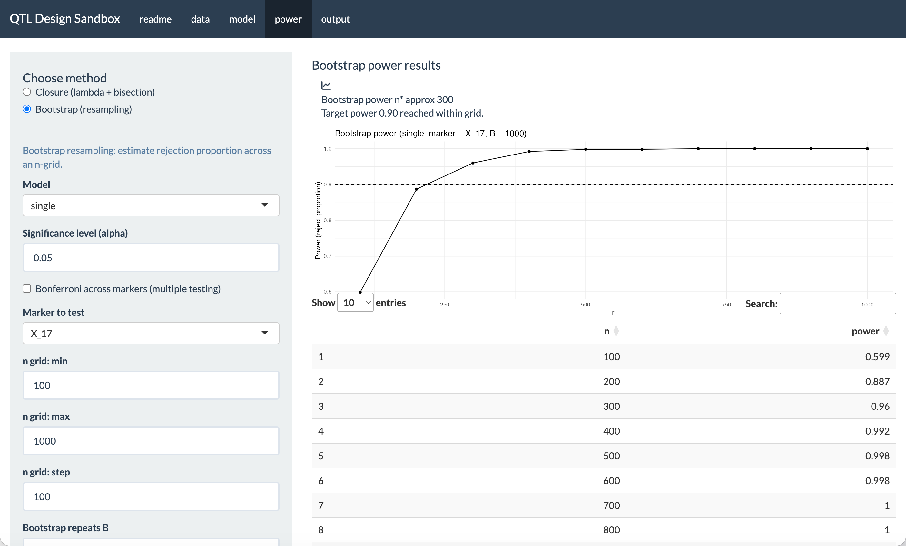

```{r setup}
library(tidyverse)
library(lme4breeding)
library(data.table)
library(glmnet)
library(broom)
library(knitr)
library(kableExtra)
library(scales)
library(irlba)
library(gt)
library(gtsummary)
library(GGally)
library(glue)
library(purrr)
library(patchwork)

set.seed(2026)

knitr::opts_chunk$set(
  fig.align = "center",
  fig.width  = 8,
  fig.height = 5,
  out.width  = "90%"
)

geno_file  <- "Genotype_data.txt"
map_file   <- "Genetic_map.txt"
pheno_file <- "Phenotype_data.txt"

options(knitr.kable.NA = "—")
options(kableExtra.latex.load_packages = FALSE)

library(dplyr)

select    <- dplyr::select
filter    <- dplyr::filter
lag       <- dplyr::lag
mutate    <- dplyr::mutate
summarise <- dplyr::summarise
left_join <- dplyr::left_join
arrange   <- dplyr::arrange
```

```{r load-data}
# ── Raw import ─────────────────────────────────────────────────────────────
geno_raw  <- fread(geno_file, header = FALSE)
map_df    <- fread(map_file)
names(map_df) <- c("SNP_ID", "Chromosome", "Pos_cM")
pheno_raw <- fread(pheno_file)

# ── Genotype matrix ──────────────────────────────────────────────────────
stopifnot(ncol(geno_raw) == nrow(map_df))

geno_df           <- as.data.frame(geno_raw)
colnames(geno_df) <- map_df$SNP_ID
geno_df$Line      <- seq_len(nrow(geno_df))

n_lines <- nrow(geno_df)
n_pheno <- nrow(pheno_raw)

# ── Phenotype data frame with season labels ──────────────────────────────
pheno_df <- pheno_raw %>%
  mutate(
    RowID  = row_number(),
    Season = case_when(
      RowID <= n_lines       ~ "Season_1",
      RowID <= 2 * n_lines   ~ "Season_2",
      TRUE                   ~ "Season_3"
    ),
    Line = rep(seq_len(n_lines), times = n_pheno / n_lines)
  ) %>%
  relocate(Line, Season, RowID)

# ── Merge to analysis dataset ─────────────────────────────────────────────
analysis_df <- pheno_df %>%
  left_join(geno_df, by = "Line")

trait_names <- c(
  "Lint_percentage",
  "Seed_index",
  "Lint_index",
  "Seed_oil_content"
)

marker_names <- map_df$SNP_ID
```

# Abstract {.unnumbered}

Identifying genomic loci associated with quantitative traits remains a central challenge in plant genetics, particularly when the number of markers far exceeds the number of genotyped individuals. Although increasing sample size can improve the power to detect causal markers, it also increases the financial and logistical burden of field trials. Power analysis is therefore essential for determining an appropriate trial scale before experiments are conducted. However, there remains a lack of accessible tools that enable agronomists and breeders with limited statistical training to evaluate statistical power under realistic trial settings.

Here, we present an interpretable simulation framework for quantitative trait analysis and power evaluation using existing marker data. We showcase its application in a cotton Multi-parent Advanced Generation Inter-Cross (MAGIC) population, where quantitative traits were simulated under a factorial design spanning different levels of genetic complexity and heritability. Using these simulated traits, we assessed the performance of four commonly used marker-selection approaches: a covariate-adjusted single-marker scan, a principal component (PC)-adjusted single-marker scan, LASSO multi-marker regression, and AIC-guided stepwise forward selection.

Our results show that single-marker scans achieved higher power but at the cost of substantially higher false discovery rates compared with LASSO. In contrast, LASSO provided a more favourable balance between power and FDR control, particularly under moderate signal strength.

To enable users to replicate the simulation framework, we developed a companion R Shiny application. The application allows users to explore the power–FDR trade-off interactively under different simulation and modelling settings, providing practical guidance for experimental design and marker-assisted breeding.

**Keywords:** QTL mapping, MAGIC population, LASSO regression, linkage disequilibrium, power analysis, Shiny application, *Gossypium hirsutum*

# Introduction

Quantitative trait locus (QTL) mapping aims to identify genomic regions whose allelic variation contributes to phenotypic differences in complex traits, and it forms the statistical foundation of marker-assisted selection (MAS), a breeding strategy that uses DNA markers linked to genes of interest to guide selection decisions independently of environmental variation [@collard2005; @hasan2021]. MAS is particularly valuable for traits with low heritability or late phenotypic expression, where direct phenotypic selection is unreliable [@collard2005]. However, the practical success of MAS depends critically on the prior identification of markers that are reliably linked to QTL [@mackay2009], which places statistical QTL detection at the centre of any marker-assisted breeding programme.

In the classical framework, individual markers are tested one at a time via regression of phenotype on genotype score. This single-marker approach is simple and computationally efficient, but it evaluates one locus at a time and does not control for the genetic background at other loci. When markers are correlated through linkage disequilibrium (LD), a single causal locus can make many nearby markers appear significant, leading to a large number of false positives [@falconer1996]. Modern genotyping methods now produce dense SNP panels where the number of markers far exceeds the number of individuals, making this problem worse [@Hastie2009; @Li2018]. Penalised regression methods such as LASSO address these limitations by jointly modelling all markers under a sparsity penalty, enforcing a compact and non-redundant selected set [@Tibshirani1996; @li2012]. However, the relative performance of marginal and joint approaches depends strongly on the underlying genetic architecture, including the number of causal loci and the proportion of phenotypic variance they explain. A systematic comparison under realistic conditions is still needed.

Beyond method comparison, power analysis is essential for determining an appropriate trial scale before experiments are conducted. Without knowing how many individuals are needed to detect QTL under different levels of heritability and genetic complexity, researchers risk running studies with insufficient statistical power that miss true signals, or overpowered studies that waste resources [@foster2006]. Although this question is recognised in the literature, there remains a lack of accessible tools that allow agronomists and breeders with limited statistical training to evaluate statistical power under realistic trial settings.

This study addresses both gaps using a cotton Multi-parent Advanced Generation Inter-Cross (MAGIC) population phenotyped for four fibre quality traits across three field seasons [@LiData2022]. MAGIC populations are particularly effective for QTL mapping because multiple cycles of intercrossing among diverse founder lines accumulate more recombination events than biparental crosses, increasing both allelic diversity and mapping resolution [@cavanagh2008]. We compare four marker selection approaches — a season-adjusted single-marker scan, a principal component (PC)-adjusted variant, LASSO multi-marker regression, and AIC-guided stepwise forward selection — under a factorial simulation design that crosses three levels of genetic complexity with three levels of heritability, using 100 replicates per cell. Our results show that single-marker scans achieve higher power but at a substantially higher false discovery rate compared with LASSO, and that the relative advantage of LASSO is clearest under moderate signal strength. To make these findings accessible to researchers without R programming expertise, we also developed the QTL Design Sandbox, an interactive R Shiny application that allows users to explore the power–FDR trade-off across a broad range of simulation and modelling settings, providing practical guidance for experimental design and breeding decisions. The data, methods, results, and discussion are presented in Sections 2–5 respectively.

# Data {#sec-data}

## Raw data and design structure

The dataset used in this study originates from a cotton MAGIC population described by @LiData2022. The genotype file contains SNP marker scores for 256 cotton lines across 6,523 marker positions, coded on the $\{-1, 0, 1\}$ scale representing the two homozygous classes and the heterozygous class respectively. The genetic map file provides the chromosome assignment and physical position in base pairs (bp) for each SNP marker. The phenotype file records measurements of four fibre quality traits — lint percentage, seed index, lint index, and seed oil content — for all 256 lines observed in three separate field seasons, yielding 768 phenotypic records in total.

Prior to analysis, missing marker values were replaced by the column mean across all 256 lines, so that no observations were lost due to occasional missing genotype calls. All 6,523 markers have positive variance across lines, so none were removed. The phenotype file requires no imputation, as all 768 records are complete. The season indicator was reconstructed by assigning the first 256 rows to Season 1, the next 256 to Season 2, and the final 256 to Season 3, consistent with a balanced multi-environment trial structure. The merged analysis dataset therefore contains 768 rows (one per line–season combination) and 6,523 marker columns alongside the phenotype and design variables.

All analyses were conducted in R [@RCoreTeam2024] using the following packages: `glmnet` [@Friedman2010] for LASSO regression; `irlba` [@baglama2005irlba] for truncated principal component analysis; `lme4breeding` [@Covarrubias2023] for the genomic mixed-effects model; `gtsummary` [@sjoberg2021gtsummary] and `kableExtra` [@zhu2024kableextra] for table formatting; and the `tidyverse` [@wickham2019tidyverse] suite for data manipulation and visualisation.

## Exploratory analysis of phenotypic traits {#sec-eda}

```{r tbl-trait-summary-by-season}
#| label: tbl-trait-summary-by-season
#| tbl-cap: "Descriptive statistics for the four analysed traits by field season and overall. Mean (SD) and Median [Min, Max] are reported."

analysis_df %>%
  select(Season, all_of(trait_names)) %>%
  mutate(
    Season = factor(
      Season,
      levels = c("Season_1", "Season_2", "Season_3"),
      labels = c("Season 1", "Season 2", "Season 3")
    )
  ) %>%
  tbl_summary(
    by      = Season,
    include = all_of(trait_names),
    type    = all_continuous() ~ "continuous2",
    statistic = all_continuous() ~ c(
      "{mean} ({sd})",
      "{median} [{min}, {max}]"
    ),
    digits  = all_continuous() ~ 2,
    label   = list(
      Lint_percentage  ~ "Lint percentage",
      Seed_index       ~ "Seed index",
      Lint_index       ~ "Lint index",
      Seed_oil_content ~ "Seed oil content"
    ),
    missing = "no"
  ) %>%
  add_overall(last = TRUE) %>%
  bold_labels() %>%
  modify_header(label ~ "**Trait**") %>%
  modify_spanning_header(all_stat_cols() ~ "**Season / Overall**") %>%
  as_kable_extra(
    booktabs  = TRUE,
    longtable = TRUE,
    linesep   = ""
  ) %>%
  kable_styling(
    latex_options = c("HOLD_position", "scale_down"),
    font_size     = 8,
    full_width    = FALSE,
    position      = "center"
  ) %>%
  column_spec(1, width = "3.2cm") %>%
  column_spec(2:5, width = "2.3cm")
```

@tbl-trait-summary-by-season reports descriptive statistics for each trait by season and overall. Lint percentage is substantially lower in Season 1 (mean 39.50) than in Seasons 2 and 3 (means 43.91 and 43.93 respectively). Seed index follows the opposite pattern, being highest in Season 1 (9.58) and declining in later seasons. Lint index is relatively stable across seasons with means between 7.54 and 7.66. Seed oil content is lowest in Season 2 (18.38) and highest in Season 3 (21.68). These mean shifts are large enough to confound marker--trait associations if season is not included as a covariate, which directly motivates its inclusion in all regression models described in @sec-methods.

The pairwise phenotypic correlations among the four traits provide additional context for interpreting the marker-selection results. The scatterplot matrix in @fig-trait-pairs reveals a strong negative phenotypic correlation between lint percentage and seed index ($r = -0.778$ overall). This negative relationship may reflect a trade-off in cotton boll development. When more resources are used for lint fibre growth, fewer resources are available for seed development [@liHeredity2022; @falconer1996]. Lint percentage and lint index are positively correlated ($r \approx 0.62$), as both measure aspects of lint accumulation. Seed oil content is weakly correlated with the other three traits, consistent with its distinct metabolic pathway.

```{r fig-trait-pairs}
#| label: fig-trait-pairs
#| fig-cap: "Pairwise scatterplot matrix for the four analysed traits, coloured by season. Lower-triangular panels show raw scatterplots. Diagonal panels show season-specific kernel density curves. Upper-triangular panels report the overall Pearson correlation and within-season correlations."
#| fig-width: 6
#| fig-height: 5.5
#| fig-pos: "t"
#| out-width: "78%"

trait_plot_df <- analysis_df %>%
  select(Season, all_of(trait_names)) %>%
  mutate(
    Season = factor(Season,
                    levels = c("Season_1", "Season_2", "Season_3"),
                    labels = c("S1", "S2", "S3"))
  )

colnames(trait_plot_df) <- c(
  "Season",
  "Lint %", "Seed idx", "Lint idx", "Seed oil"
)

ggpairs(
  trait_plot_df,
  columns     = 2:5,
  aes(colour = Season, alpha = 0.4),
  upper = list(continuous = wrap("cor", size = 3.2)),
  diag  = list(continuous = wrap("densityDiag", alpha = 0.4)),
  lower = list(continuous = wrap("points", size = 0.5, alpha = 0.3))
) +
  theme_minimal(base_size = 10) +
  theme(strip.text = element_text(size = 9))
```

## Genotype principal components and population structure {#sec-pca}

The genotype principal components (PCs) summarise the major axes of genetic variation among the 256 cotton lines and are used as covariates in the PC-adjusted scan (@eq-pc-scan) to control for population structure.

```{r compute-pca}
# ── Prepare full genotype matrix (all 256 lines same as geno_df) ────────
X_geno       <- geno_df %>% select(-Line) %>% as.matrix()
mode(X_geno) <- "numeric"

# Mean-impute missing values column-wise
for (j in seq_len(ncol(X_geno))) {
  miss_idx <- is.na(X_geno[, j])
  if (any(miss_idx)) X_geno[miss_idx, j] <- mean(X_geno[, j], na.rm = TRUE)
}

# Remove zero-variance markers
marker_keep  <- apply(X_geno, 2, function(x) var(x, na.rm = TRUE) > 0)
X_geno       <- X_geno[, marker_keep, drop = FALSE]
marker_names <- colnames(X_geno)

# PCA via truncated SVD — scale = TRUE so all markers contribute equally
set.seed(123)
pca_fit <- prcomp_irlba(
  x      = scale(X_geno, center = TRUE, scale = TRUE),
  n      = 20,
  center = FALSE,
  scale. = FALSE
)

# Variance explained
var_explained     <- (pca_fit$sdev^2) / sum(pca_fit$sdev^2)
cum_var_explained <- cumsum(var_explained)

pca_var_df <- tibble(
  PC         = seq_along(var_explained),
  Var_Expl   = var_explained,
  Cumulative = cum_var_explained
)

# PC scores (rows = lines in same order as geno_df)
pca_scores <- as_tibble(pca_fit$x[, 1:5, drop = FALSE]) %>%
  setNames(paste0("PC", 1:5)) %>%
  mutate(Line = seq_len(n()))

# Line-averaged trait values for annotation plots
trait_line_mean <- pheno_df %>%
  group_by(Line) %>%
  summarise(across(all_of(trait_names), ~ mean(.x, na.rm = TRUE)),
            .groups = "drop")

pca_scores <- pca_scores %>%
  left_join(trait_line_mean, by = "Line")

# Attach PCs to analysis_df 
pc_line_df  <- pca_scores %>% select(Line, PC1, PC2, PC3, PC4, PC5)
analysis_df <- analysis_df %>%
  select(-any_of(paste0("PC", 1:5))) %>%
  left_join(pc_line_df, by = "Line") %>%
  mutate(Season = factor(Season))
```

```{r fig-pca-scatter}
#| label: fig-pca-scatter
#| fig-cap: "Scatterplots of the first three genotype principal components coloured by k-means cluster. The broad but continuous genetic structure suggests gradual rather than sharply discrete population structure."
#| fig-pos: "H"
#| fig-width: 8
#| fig-height: 3.8
#| out-width: "85%"

set.seed(123)
pca_cluster           <- kmeans(pca_scores[, 1:3], centers = 3)$cluster
pca_scores$Cluster    <- factor(pca_cluster)

p1 <- ggplot(pca_scores, aes(PC1, PC2, colour = Cluster)) +
  geom_point(size = 2, alpha = 0.75) +
  labs(title = "PC1 vs PC2") +
  theme_minimal(base_size = 13) +
  scale_colour_discrete(name = "K-means cluster") +
  theme(legend.position = "bottom")

p2 <- ggplot(pca_scores, aes(PC1, PC3, colour = Cluster)) +
  geom_point(size = 2, alpha = 0.75) +
  labs(title = "PC1 vs PC3") +
  scale_colour_discrete(name = "K-means cluster") +
  theme_minimal(base_size = 13) +
  theme(legend.position = "bottom")

p1 + p2
```

@fig-pca-scatter shows that the cotton lines form broad genetic groups with continuous rather than sharply separated boundaries. Population structure is present but gradual. This supports the use of leading genotype PCs as covariates in the single-marker scans to adjust for population structure.

# Methods {#sec-methods}

```{r helper-functions}
# ── Utility: marker matrix with mean imputation ───────────────────────────
prep_marker_matrix <- function(df, marker_names) {
  df  <- as.data.frame(df)
  X   <- as.matrix(df[, marker_names, drop = FALSE])
  mode(X) <- "numeric"
  if (anyNA(X)) {
    col_means <- colMeans(X, na.rm = TRUE)
    idx       <- which(is.na(X), arr.ind = TRUE)
    X[idx]    <- col_means[idx[, 2]]
  }
  X
}

# ── Fast single-marker scan via QR residualisation ───────────────────────
fast_single_marker_scan_cov <- function(df, trait, marker_names,
                                         covariates = "Season") {
  df          <- as.data.frame(df)
  needed_cols <- unique(c(trait, covariates, marker_names))
  df          <- df[, needed_cols, drop = FALSE]
  keep        <- complete.cases(df[, c(trait, covariates), drop = FALSE])
  df          <- df[keep, , drop = FALSE]

  y   <- df[[trait]]
  X   <- prep_marker_matrix(df, marker_names)
  C   <- model.matrix(as.formula(paste("~", paste(covariates, collapse = " + "))),
                      data = df)
  qrC <- qr(C)

  y_res  <- qr.resid(qrC, y)
  X_res  <- qr.resid(qrC, X)
  Sxx    <- colSums(X_res^2)
  Sxy    <- as.vector(crossprod(X_res, y_res))
  Syy    <- sum(y_res^2)
  df_res <- nrow(df) - qrC$rank - 1L
  valid  <- Sxx > 1e-12

  beta <- rss <- se <- tval <- pval <- rep(NA_real_, length(marker_names))
  beta[valid]  <- Sxy[valid] / Sxx[valid]
  rss[valid]   <- pmax(Syy - Sxy[valid]^2 / Sxx[valid], 0)
  se[valid]    <- sqrt((rss[valid] / df_res) / Sxx[valid])
  tval[valid]  <- beta[valid] / se[valid]
  pval[valid]  <- 2 * pt(abs(tval[valid]), df = df_res, lower.tail = FALSE)

  tibble(
    trait      = trait,
    SNP_ID     = marker_names,
    estimate   = beta,
    std.error  = se,
    statistic  = tval,
    p.value    = pval,
    covariates = paste(covariates, collapse = " + "),
    df_resid   = df_res
  )
}

# ── Multiple-testing correction ──────────────────────────────────────────
add_multiple_testing <- function(scan_df, alpha = 0.05) {
  scan_df %>%
    group_by(trait, covariates) %>%
    arrange(p.value, .by_group = TRUE) %>%
    mutate(
      p_adj_bh   = p.adjust(p.value, method = "BH"),
      p_adj_bonf = p.adjust(p.value, method = "bonferroni"),
      sig_raw    = p.value    < alpha,
      sig_bh     = p_adj_bh  < alpha,
      sig_bonf   = p_adj_bonf < alpha
    ) %>%
    ungroup()
}

select_marker_set <- function(scan_df, trait_name,
                               rule = c("bh", "bonf", "top"), top_n = 50) {
  rule <- match.arg(rule)
  df   <- scan_df %>% filter(trait == trait_name) %>% arrange(p.value)
  if (rule == "bh")   return(df %>% filter(sig_bh)   %>% pull(SNP_ID) %>% unique())
  if (rule == "bonf") return(df %>% filter(sig_bonf) %>% pull(SNP_ID) %>% unique())
  df %>% slice_head(n = top_n) %>% pull(SNP_ID) %>% unique()
}

# ── LASSO ────────────────────────────────────────────────────────────────
run_lasso_trait <- function(df, trait, marker_names,
                             covariates = c("Season", "PC1", "PC2",
                                            "PC3", "PC4", "PC5"),
                             alpha = 1, nfolds = 10, seed = 123) {
  df   <- as.data.frame(df)
  keep <- complete.cases(df[, c(trait, covariates), drop = FALSE])
  df   <- df[keep, , drop = FALSE]

  y        <- df[[trait]]
  X_marker <- prep_marker_matrix(df, marker_names)
  X_cov    <- model.matrix(reformulate(covariates), data = df)[, -1, drop = FALSE]
  x_all    <- cbind(X_cov, X_marker)
  cov_names      <- colnames(X_cov)
  penalty_factor <- c(rep(0, ncol(X_cov)), rep(1, ncol(X_marker)))

  set.seed(seed)
  cvfit <- cv.glmnet(
    x = x_all, y = y,
    family = "gaussian", alpha = alpha, nfolds = nfolds,
    standardize = TRUE, intercept = TRUE,
    penalty.factor = penalty_factor
  )

  coef_min <- coef(cvfit, s = "lambda.min")
  coef_1se <- coef(cvfit, s = "lambda.1se")
  nz_min   <- setdiff(rownames(coef_min)[as.vector(coef_min != 0)], "(Intercept)")
  nz_1se   <- setdiff(rownames(coef_1se)[as.vector(coef_1se != 0)], "(Intercept)")

  tibble(
    trait                  = trait,
    lambda_min             = cvfit$lambda.min,
    lambda_1se             = cvfit$lambda.1se,
    n_selected_markers_min = length(setdiff(nz_min, cov_names)),
    n_selected_markers_1se = length(setdiff(nz_1se, cov_names)),
    covariates_nonzero_min = list(intersect(nz_min, cov_names)),
    covariates_nonzero_1se = list(intersect(nz_1se, cov_names)),
    selected_markers_min   = list(setdiff(nz_min, cov_names)),
    selected_markers_1se   = list(setdiff(nz_1se, cov_names)),
    cvfit                  = list(cvfit)
  )
}

get_lasso_markers <- function(lasso_tbl, trait_name, rule = c("1se", "min")) {
  rule <- match.arg(rule)
  col  <- if (rule == "1se") "selected_markers_1se" else "selected_markers_min"
  out  <- lasso_tbl %>% filter(trait == trait_name) %>% pull(col)
  if (length(out) == 0) return(character(0))
  unique(out[[1]])
}

# ── Jaccard similarity ────────────────────────────────────────────────────
jaccard_index <- function(a, b) {
  a <- unique(a); b <- unique(b)
  u <- length(union(a, b))
  if (u == 0) return(NA_real_)
  length(intersect(a, b)) / u
}

# ── Power-analysis performance metrics ───────────────────────────────────
calc_selection_metrics <- function(selected, truth) {
  selected <- unique(selected); truth <- unique(truth)
  tp <- sum(selected %in% truth)
  fp <- sum(!(selected %in% truth))
  fn <- sum(!(truth %in% selected))
  tibble(
    n_selected  = length(selected), n_true = length(truth),
    tp = tp, fp = fp, fn = fn,
    exact_power = tp / length(truth),
    precision   = if (length(selected) == 0) NA_real_ else tp / length(selected),
    fdr         = if (length(selected) == 0) 0        else fp / length(selected)
  )
}

# ── Stepwise selection ────────────────────────────────────────────────────
run_stepwise_trait <- function(df, trait, marker_names,
                                covariates       = c("Season","PC1","PC2",
                                                    "PC3","PC4","PC5"),
                                top_n_candidates = 50,
                                direction        = "both",
                                seed             = 123) {
  df   <- as.data.frame(df)
  keep <- complete.cases(df[, c(trait, covariates), drop = FALSE])
  df   <- df[keep, , drop = FALSE]

  pre_scan <- fast_single_marker_scan_cov(
    df, trait, marker_names,
    covariates = covariates
  ) %>% arrange(p.value) %>% slice_head(n = top_n_candidates)
  candidates <- pre_scan$SNP_ID

  safe_names <- make.names(candidates)
  marker_df  <- as.data.frame(
    prep_marker_matrix(df, candidates),
    stringsAsFactors = FALSE
  )
  colnames(marker_df) <- safe_names

  df_sw <- bind_cols(df %>% select(all_of(c(trait, covariates))), marker_df)

  null_formula <- reformulate(covariates, response = trait)
  null_model   <- lm(null_formula, data = df_sw)
  full_scope   <- reformulate(c(covariates, safe_names), response = trait)
  full_model   <- lm(full_scope, data = df_sw)

  set.seed(seed)
  step_model <- tryCatch(
    suppressWarnings(
      step(null_model,
           scope     = list(lower = null_model, upper = full_model),
           direction = direction, trace = 0)
    ),
    error = function(e) {
      tryCatch(
        suppressWarnings(
          step(null_model,
               scope     = list(lower = null_model, upper = full_model),
               direction = "forward", trace = 0)
        ),
        error = function(e2) null_model
      )
    }
  )

  coef_nms     <- names(coef(step_model))
  sel_safe     <- setdiff(coef_nms, c("(Intercept)", covariates,
                                       paste0("Season", c("Season_2","Season_3")),
                                       "SeasonSeason_2","SeasonSeason_3"))
  name_map     <- setNames(candidates, safe_names)
  sel_original <- unname(name_map[sel_safe])
  sel_original <- sel_original[!is.na(sel_original)]

  tibble(
    trait              = trait,
    n_selected_markers = length(sel_original),
    selected_markers   = list(sel_original)
  )
}
```

## Single-marker regression models {#sec-scan}

The most common approach to QTL mapping is single-marker regression, in which each marker is tested independently for association with the trait. For marker $j$ and trait observation $y_{is}$ (line $i$, season $s$), the additive model is:

$$
y_{is} = \alpha + \gamma_s + \beta_j x_{ij} + \varepsilon_{is},
\qquad \varepsilon_{is} \overset{\text{i.i.d.}}{\sim} \mathcal{N}(0, \sigma^2),
$$ {#eq-single-marker}

where $\alpha$ is the intercept, $\gamma_s$ are season fixed effects, $x_{ij}$ is the genotype score of line $i$ at marker $j$ coded as $\{-1, 0, 1\}$, and $\beta_j$ is the additive marker effect. The null hypothesis $H_0{:}\; \beta_j = 0$ is tested using a Wald $t$-statistic with $(n - \text{rank}(\mathbf{C}) - 1)$ residual degrees of freedom, where $\mathbf{C}$ is the covariate design matrix. Computationally, all markers are evaluated efficiently by QR decomposition of the covariate matrix, residualising both $\mathbf{y}$ and $\mathbf{X}$ with respect to the covariates, and computing the inner-product statistics on the residual matrices.

A second scan specification adds the first five genotype principal components as additional covariates, replacing $\gamma_s$ in @eq-single-marker with both season indicators and the PC scores:

$$
y_{is} = \alpha + \gamma_s + \sum_{k=1}^{5} \delta_k \text{PC}_{ik} + \beta_j x_{ij} + \varepsilon_{is}.
$$ {#eq-pc-scan}

Including the PCs adjusts for the broad genetic structure visible in @fig-pca-scatter and can attenuate associations that are driven by population structure rather than local marker effects [@Price2006].

## LASSO multi-marker regression {#sec-lasso}

In the high-dimensional setting where $p \gg n$, single-marker scans remain valid as marginal screening tools but cannot jointly estimate the effects of all markers simultaneously. The LASSO [@Tibshirani1996] addresses this by estimating the full vector of marker effects $\boldsymbol{\beta}$ subject to an $\ell_1$ penalty:

$$
\min_{\alpha, \boldsymbol{\beta}, \boldsymbol{\gamma}, \boldsymbol{\delta}}
\frac{1}{n}
\left\|
\mathbf{y}
- \alpha \mathbf{1}
- \mathbf{G}\boldsymbol{\beta}
- \mathbf{C}_{\text{season}} \boldsymbol{\gamma}
- \mathbf{C}_{\text{PC}} \boldsymbol{\delta}
\right\|_2^2
+ \lambda \sum_{j=1}^{p} |\beta_j|,
$$ {#eq-lasso}

where $\mathbf{G}$ is the $n \times p$ genotype matrix, $\mathbf{C}_{\text{season}}$ and $\mathbf{C}_{\text{PC}}$ are covariate matrices for season and PC effects, and $\lambda > 0$ is the penalty parameter. Crucially, only the marker-effect vector $\boldsymbol{\beta}$ is penalised; the season and PC coefficients $\boldsymbol{\gamma}$ and $\boldsymbol{\delta}$ are included as unpenalised adjustment covariates. The $\ell_1$ penalty induces sparsity by shrinking many $\hat\beta_j$ exactly to zero, retaining only the markers most informative for prediction after accounting for the correlation structure of the marker panel [@Tibshirani1996].

The penalty parameter $\lambda$ is chosen by ten-fold cross-validation using the `cv.glmnet` function from the `glmnet` package [@Friedman2010]. Two solutions are considered: $\lambda_\text{min}$, which minimises cross-validated prediction error, and $\lambda_{1\text{se}}$, which is the largest $\lambda$ whose error is within one standard error of the minimum. Because $\lambda_{1\text{se}}$ applies a stronger penalty, it yields a smaller and more stable selected set; it is used as the primary reported result.

## Mixed-effects model and heritability estimation {#sec-lmm}

A genomic linear mixed-effects model is fitted to obtain trait-level heritability estimates independently of the marker selection procedure. For line $i$ observed in season $s$:

$$
y_{is} = \alpha + \gamma_s + u_i + \varepsilon_{is},
\quad \mathbf{u} \sim \mathcal{N}(\mathbf{0},\, \sigma_g^2 \mathbf{G}),
\quad \boldsymbol{\varepsilon} \sim \mathcal{N}(\mathbf{0},\, \sigma_e^2 \mathbf{I}),
$$ {#eq-mixed-model}

where $u_i$ is the random genetic effect for line $i$, and $\mathbf{G}$ is the genomic relationship matrix (GRM). Since the SNP markers are coded as $\{-1, 0, 1\}$ rather than the more common$\{0, 1, 2\}$ format, each marker column in the matrix $\mathbf{M}$ is first standardised to have mean zero and variance one. The GRM is then computed from the standardised marker matrix:

$$
\mathbf{G} = \frac{\mathbf{M}^* {\mathbf{M}^*}^\top}{p},
$$ {#eq-grm}

where $\mathbf{M}^*$ is the $n \times p$ standardised marker matrix. A small ridge term ($0.05 \times \mathbf{I}$) is added to the diagonal to guarantee positive definiteness. Variance components $\hat\sigma_g^2$ and $\hat\sigma_e^2$ are estimated by restricted maximum likelihood (REML), and heritability is computed as:

$$
\hat{h}^2 = \frac{\hat\sigma_g^2}{\hat\sigma_g^2 + \hat\sigma_e^2}.
$$ {#eq-heritability}

The model is fitted using the `lme4breeding` package [@Covarrubias2023] with season as a fixed effect using treatment (dummy) coding, with Season 1 as the reference level.

## Stepwise multi-marker selection {#sec-stepwise}

The fourth approach uses AIC-guided stepwise forward-and-backward selection. Fitting a model with all $p = 6{,}523$ markers would be computationally difficult and statistically unstable. Therefore, the candidate pool is first reduced to the 50 markers with the smallest marginal $p$-values from the PC-adjusted scan. This two-stage strategy — marginal screening followed by joint model selection — is a standard approach when the marker dimension far exceeds the sample size, as it renders the subsequent model search computationally tractable while concentrating candidates on the markers most likely to include genuine QTL signals [@foster2006]. Stepwise selection using the R `step()` function then iterates over this candidate pool, starting from the null model containing only the season and PC covariates, and adding or removing one marker at each step according to the AIC criterion [@akaike1974aic]. The final retained marker set is reported as the selected set for that trait. This approach differs from LASSO in two key respects: it makes hard in/out decisions rather than applying continuous shrinkage, and it is guided by AIC rather than cross-validated prediction error. Its primary limitation relative to lasso is the risk that true causal markers may be discarded at the pre-filtering stage before stepwise selection begins [@foster2006].

Bayesian shrinkage is another alternative to stepwise selection and LASSO. It assigns prior distributions to marker effects, allowing the amount of shrinkage to vary across markers. Methods such as BayesB [@xu2003] assign a separate precision parameter $\lambda_j$ to each marker, with these parameters drawn from a Gamma prior. This allows markers with stronger evidence to be shrunk less than markers with weaker evidence. While Bayesian approaches can outperform LASSO when effect sizes are highly heterogeneous, they are computationally intensive and require specification of prior settings. For the present dataset with 6,523 markers, the penalised regression approach via `glmnet` offers a computationally practical alternative that retains the key sparsity property.

## Multiple-testing correction {#sec-mt}

Because the single-marker scans evaluate all 6,523 markers simultaneously, raw $p$-values require multiple-testing adjustment. Two methods are applied. The Benjamini--Hochberg (BH) procedure [@BenjaminiHochberg1995] controls the expected false discovery rate (FDR) and is less conservative than the Bonferroni correction, which controls the family-wise error rate at threshold $\alpha / p$. For the main comparisons, BH-significant sets are used because they provide a more practical balance between false-positive control and detection power in high-dimensional settings. Both correction results are reported for completeness.

## Comparing selected marker sets {#sec-marker-compare}

Pairwise overlap between selected marker sets is quantified using the Jaccard similarity index [@Jaccard1901]:

$$
J(A, B) = \frac{|A \cap B|}{|A \cup B|},
$$

which equals 1 when two sets are identical and 0 when they share no members. For the simulation study, let $\hat{\mathcal{S}}$ be the selected marker set and $\mathcal{C}$ the true causal set. Power (recall), precision, FDR, and the F1 score are defined as:

$$
\text{Power} = \frac{|\hat{\mathcal{S}} \cap \mathcal{C}|}{|\mathcal{C}|},
\qquad
\text{Precision} = \frac{|\hat{\mathcal{S}} \cap \mathcal{C}|}{|\hat{\mathcal{S}}|},
\qquad
\text{FDR} = 1 - \text{Precision},
\qquad
\text{F1} = \frac{2 \times \text{Precision} \times \text{Power}}{\text{Precision} + \text{Power}}.
$$

The F1 score provides a single summary statistic that balances sensitivity and specificity and is used as the primary criterion for comparing methods in the simulation study.

## Power analysis by simulation {#sec-power-design}

To evaluate method performance under controlled conditions, phenotypes are simulated using the observed cotton genotype matrix so that the true marker correlation structure is preserved. This is essential because methods relying on marginal testing are affected by LD in ways that independence-based simulations would not capture.

For each replicate, $n_\text{causal}$ markers are drawn uniformly at random. Their standardised genotype scores are combined into a genetic component $\mathbf{g} = \mathbf{X}_\text{causal} \boldsymbol{\beta}_\text{true}$, where $\boldsymbol{\beta}_\text{true}$ is sampled from a standard normal distribution and normalised to unit $\ell_2$ norm. A seasonal component and independent error are added:

$$
y_{is} = \sqrt{h_g^2}\; g_i + \sqrt{h_s^2}\; s_i + \sqrt{1 - h_g^2 - h_s^2}\; \varepsilon_{is},
$$ {#eq-sim-pheno}

where $h_g^2$ is the genetic heritability, $h_s^2 = 0.20$ is the season heritability, and all three components are scaled to unit variance before combining. All four methods are then fitted to the simulated phenotype and their selected marker sets are recorded. The simulation adopts a $3 \times 3$ factorial design crossing three genetic architecture levels ($n_\text{causal} \in \{10, 25, 100\}$, labelled Sparse, Moderate, and Polygenic) with three signal-strength levels ($h_g^2 \in \{0.35, 0.20, 0.10\}$), run for 100 replicates per cell.

```{r tbl-power-scenarios}
#| label: tbl-power-scenarios
#| tbl-cap: "Factorial simulation design crossing genetic architecture (causal marker count) with signal strength (genetic heritability $h_g^2$). Season heritability $h_s^2 = 0.20$ is fixed throughout."

expand.grid(
  Architecture = c("Sparse", "Moderate", "Polygenic"),
  Strength     = c("Strong", "Moderate", "Weak")
) %>%
  mutate(
    Causal    = case_when(Architecture == "Sparse"    ~ 10L,
                          Architecture == "Moderate"  ~ 25L,
                          Architecture == "Polygenic" ~ 100L),
    `$h_g^2$` = case_when(Strength == "Strong"   ~ 0.35,
                           Strength == "Moderate" ~ 0.20,
                           Strength == "Weak"     ~ 0.10),
    `$h_s^2$`    = 0.20,
    `Error var.` = 1 - `$h_g^2$` - `$h_s^2$`
  ) %>%
  arrange(Causal, desc(`$h_g^2$`)) %>%
  select(Architecture, Strength, Causal, `$h_g^2$`, `$h_s^2$`, `Error var.`) %>%
  knitr::kable(
    format    = "latex",
    booktabs  = TRUE,
    escape    = FALSE,
    col.names = c("Architecture", "Strength", "$n_{\\text{causal}}$",
                  "$h_g^2$", "$h_s^2$", "Error var.")
  ) %>%
  kableExtra::kable_styling(latex_options = c("HOLD_position"), font_size = 10) %>%
  kableExtra::column_spec(1:2, width = "2.5cm") %>%
  kableExtra::column_spec(3:6, width = "1.8cm") %>%
  kableExtra::pack_rows("Sparse (causal = 10)",     1, 3) %>%
  kableExtra::pack_rows("Moderate (causal = 25)",   4, 6) %>%
  kableExtra::pack_rows("Polygenic (causal = 100)", 7, 9)
```

## QTL Design Sandbox: interactive Shiny companion {#sec-shiny}

An interactive R Shiny application, the **QTL Design Sandbox**, is developed as a companion tool to the analytical framework described in the previous sections. The application makes the core statistical concepts of this study — trait simulation, marker selection modelling, power analysis, and FDR control — accessible to users without requiring them to write or execute R code directly. It is designed to serve two complementary purposes: as a teaching tool that illustrates the statistical principles behind each modelling approach, and as an exploratory sandbox that allows researchers to test design decisions before committing to a full analysis.

The application is structured around five functional modules that correspond directly to the analytical steps in this paper:

**Data Input.** Users may upload a custom CSV genotype matrix (individuals by markers) or load a built-in example dataset. The expected input format is a numeric $n \times p$ matrix with individuals in rows and markers in columns, similar to the genotype matrix described in @sec-data. Note that the actual cotton dataset used in this study is not bundled with the application; all in-app analyses are performed on user-uploaded data or the built-in toy dataset.

**Trait Simulation.** Users specify the number of QTL ($n_\text{causal}$), the effect-size distribution, and the proportion of variance explained by genetics ($h_g^2$) and season ($h_s^2$). The module then generates a phenotype vector using the simulation model in @eq-sim-pheno applied to the uploaded or built-in example genotype matrix. This module mirrors the simulation framework described in @sec-power-design: by varying $n_\text{causal}$ and $h_g^2$, users can explore the same factorial parameter space as in @tbl-power-scenarios, applied to their own or the example dataset rather than the cotton data used in this study.

**Model Fitting.** Users choose between single-marker regression (corresponding to @sec-scan) or a multi-marker model (corresponding to @sec-lasso), execute the chosen method, and view a results table reporting marker estimates, $p$-values, LOD scores, and likelihood-ratio test statistics. The visual output makes the contrast between marginal and joint testing immediately apparent: single-marker models flag broad genomic peaks, while multi-marker models retain only a few representative markers.

**Power Analysis.** This module implements the resampling-based framework from @sec-power-design. Users specify a range of sample sizes and run either a bootstrap simulation or a $\lambda$/NCP-based theoretical power calculation. The output includes a power curve plot (proportion of true QTL detected vs. sample size) and an FDR curve plot (expected false-discovery proportion vs. sample size), directly visualising the trade-off that is analysed numerically in @sec-res-power. The module also reports the minimum sample size required to achieve a user-specified target power, providing practical guidance for experimental design.

**Output and Reporting.** Summary tables, parameter settings, and plots — including power curves, FDR curves, and model result tables — can be exported as a self-contained HTML report. This feature supports reproducibility by documenting the exact simulation parameters and results used in any given session.

The Shiny application is available at <https://github.com/ShiyanMiao/SCNC2021/tree/main/R-shiny-app-final-vesrion> and requires R $\geq$ 4.1 with the packages `shiny`, `ggplot2`, `DT`, `shinydashboard`, and `shinythemes` installed. A README file in the repository provides step-by-step instructions for running the application. An extended user guide is provided on the application's **Readme** tab. Together with the formal simulation results in @sec-res-power, the Shiny tool provides an accessible framework for exploring the power-FDR trade-off in QTL mapping under different design assumptions, using user-supplied or example data.

![**Screenshot of the QTL Design Sandbox Shiny application.** The interface provides access to the five functional modules: Data Input, Trait Simulation, Model Fitting, Power Analysis, and Output and Reporting. Users can interactively adjust genetic architecture parameters ($n_\text{causal}$, $h_g^2$) and immediately visualise the resulting power and FDR curves, directly mirroring the factorial simulation framework described in @sec-power-design. The source code is available at <https://github.com/ShiyanMiao/SCNC2021/tree/main/R-shiny-app-final-vesrion>.](Figure_6.png){#fig-shiny-screenshot fig-align="center" width="72%"}

```{r power-simulation-functions}
simulate_trait <- function(df, causal_markers,
                            genetic_r2 = 0.30, season_r2 = 0.20,
                            seed = NULL) {
  if (!is.null(seed)) set.seed(seed)
  stopifnot(genetic_r2 > 0, season_r2 >= 0, genetic_r2 + season_r2 < 1)

  X_causal          <- prep_marker_matrix(df, causal_markers)
  X_causal          <- scale(X_causal)
  beta_raw          <- rnorm(length(causal_markers))
  beta_raw          <- beta_raw / sqrt(sum(beta_raw^2))
  genetic_component <- as.numeric(scale(as.vector(X_causal %*% beta_raw)))
  season_template   <- c("Season_1" = -1, "Season_2" = 0, "Season_3" = 1)
  season_component  <- as.numeric(
    scale(unname(season_template[as.character(df$Season)])))
  error_component   <- as.numeric(scale(rnorm(nrow(df))))

  sim_trait <- sqrt(genetic_r2)                  * genetic_component +
               sqrt(season_r2)                   * season_component  +
               sqrt(1 - genetic_r2 - season_r2)  * error_component
  tibble(sim_trait = sim_trait,
         genetic_component = genetic_component,
         season_component  = season_component,
         error_component   = error_component)
}

fit_all_models <- function(df_sim, marker_names,
                            lasso_nfolds = 5, seed = 123) {
  season_scan <- fast_single_marker_scan_cov(
    df = df_sim, trait = "sim_trait",
    marker_names = marker_names, covariates = "Season"
  ) %>% mutate(log10p = -log10(p.value)) %>% add_multiple_testing()

  pca_scan <- fast_single_marker_scan_cov(
    df = df_sim, trait = "sim_trait",
    marker_names = marker_names,
    covariates = c("Season", "PC1", "PC2", "PC3", "PC4", "PC5")
  ) %>% mutate(log10p = -log10(p.value)) %>% add_multiple_testing()

  lasso_fit <- run_lasso_trait(
    df = df_sim, trait = "sim_trait",
    marker_names = marker_names,
    covariates   = c("Season", "PC1", "PC2", "PC3", "PC4", "PC5"),
    alpha = 1, nfolds = lasso_nfolds, seed = seed
  )

  stepwise_fit <- run_stepwise_trait(
    df               = df_sim,
    trait            = "sim_trait",
    marker_names     = marker_names,
    covariates       = c("Season", "PC1", "PC2", "PC3", "PC4", "PC5"),
    top_n_candidates = 50,
    direction        = "both",
    seed             = seed
  )

  list(season_scan  = season_scan,
       pca_scan     = pca_scan,
       lasso_fit    = lasso_fit,
       stepwise_fit = stepwise_fit)
}

run_power_scenario <- function(df, marker_names, scenario_name,
                                n_causal, genetic_r2, season_r2,
                                nsim = 50, lasso_nfolds = 5,
                                seed = 2026, scenario_idx = 0L) {
  out  <- vector("list", nsim)
  base <- seed + scenario_idx * 100L

  for (b in seq_len(nsim)) {
    set.seed(base + b)
    causal_markers <- sample(marker_names, size = n_causal, replace = FALSE)
    sim_obj <- simulate_trait(df = df, causal_markers = causal_markers,
                               genetic_r2 = genetic_r2, season_r2 = season_r2,
                               seed = base + 1000L + b)
    df_sim  <- df %>% mutate(sim_trait = sim_obj$sim_trait)
    fit_obj <- fit_all_models(df_sim, marker_names,
                               lasso_nfolds = lasso_nfolds,
                               seed = base + 2000L + b)

    selected_sets <- list(
      `Season-only scan (BH)` =
        select_marker_set(fit_obj$season_scan, "sim_trait", rule = "bh"),
      `PCA-adjusted scan (BH)` =
        select_marker_set(fit_obj$pca_scan,    "sim_trait", rule = "bh"),
      `Lasso + PC + Season (lambda.1se)` =
        get_lasso_markers(fit_obj$lasso_fit, "sim_trait", rule = "1se"),
      `Stepwise (AIC)` =
        fit_obj$stepwise_fit$selected_markers[[1]]
    )

    out[[b]] <- bind_rows(lapply(names(selected_sets), function(m) {
      calc_selection_metrics(selected_sets[[m]], causal_markers) %>%
        mutate(scenario = scenario_name, sim = b, method = m,
               n_causal = n_causal, genetic_r2 = genetic_r2,
               season_r2 = season_r2)
    }))
  }
  bind_rows(out)
}
```

# Results {#sec-results}

## Variance components and heritability estimates {#sec-res-lmm}

All four traits exhibit substantial genetic control of phenotypic variation, as evidenced by the heritability estimates obtained from the genomic mixed-effects model described in @sec-lmm. Heritability $\hat{h}^2$ is computed from the REML variance component estimates according to @eq-heritability: $\hat{h}^2 = \hat{\sigma}_g^2 / (\hat{\sigma}_g^2 + \hat{\sigma}_e^2)$, where $\hat{\sigma}_g^2$ is the genetic variance captured by the genomic relationship matrix and $\hat{\sigma}_e^2$ is the residual variance. These estimates approximate the proportion of phenotypic variance captured by the genomic relationship matrix constructed from the 6,523 SNP markers used in this study. The variance component estimates are summarised in @tbl-lmm.

```{r fit-lmm}
#| label: fit-lmm
#| cache: false
#| message: false
#| warning: false
#| results: 'hide'

df_s1  <- as.data.frame(analysis_df)[analysis_df$Season == "Season_1", ]
M_raw  <- as.matrix(df_s1[, marker_names, drop = FALSE])
M_imp  <- apply(M_raw, 2, function(x) { x[is.na(x)] <- mean(x, na.rm = TRUE); x })
var_cols <- apply(M_imp, 2, var) > 0
M_imp    <- M_imp[, var_cols, drop = FALSE]

M_std  <- scale(M_imp, center = TRUE, scale = TRUE)
G_mat  <- tcrossprod(M_std) / ncol(M_std)
G_mat  <- (G_mat + t(G_mat)) / 2
diag(G_mat) <- diag(G_mat) + 0.05
rownames(G_mat) <- colnames(G_mat) <- as.character(df_s1$Line)

df_lmm <- as.data.frame(analysis_df) |>
  dplyr::mutate(LineF  = factor(as.character(Line)),
                Season = factor(Season))

fit_lint_pct <- lmebreed(Lint_percentage  ~ Season + (1 | LineF),
                          relmat = list(LineF = G_mat), data = df_lmm)
fit_seed_idx <- lmebreed(Seed_index       ~ Season + (1 | LineF),
                          relmat = list(LineF = G_mat), data = df_lmm)
fit_lint_idx <- lmebreed(Lint_index       ~ Season + (1 | LineF),
                          relmat = list(LineF = G_mat), data = df_lmm)
fit_seed_oil <- lmebreed(Seed_oil_content ~ Season + (1 | LineF),
                          relmat = list(LineF = G_mat), data = df_lmm)

extract_h2 <- function(fit) {
  vc   <- lme4::VarCorr(fit)
  s2g  <- as.numeric(vc$LineF)
  s2e  <- sigma(fit)^2
  list(s2g = s2g, s2e = s2e, h2 = s2g / (s2g + s2e))
}

h2_list <- list(
  "Lint percentage"  = extract_h2(fit_lint_pct),
  "Seed index"       = extract_h2(fit_seed_idx),
  "Lint index"       = extract_h2(fit_lint_idx),
  "Seed oil content" = extract_h2(fit_seed_oil)
)

lmm_results <- tibble(
  trait    = names(h2_list),
  sigma2_g = round(sapply(h2_list, `[[`, "s2g"), 4),
  sigma2_e = round(sapply(h2_list, `[[`, "s2e"), 4),
  h2       = round(sapply(h2_list, `[[`, "h2"),  3),
  n_obs    = as.integer(nobs(fit_lint_pct))
)
```

```{r tbl-lmm}
#| label: tbl-lmm
#| tbl-pos: "H"
#| tbl-cap: "Variance component estimates from the genomic mixed-effects model (season fixed, genotype random with GRM). $\\hat\\sigma_g^2$: genetic variance; $\\hat\\sigma_e^2$: residual variance; $\\hat{h}^2$:heritability."
lmm_results |>
  knitr::kable(
    format    = "latex",
    booktabs  = TRUE,
    escape    = FALSE,
    digits    = 3,
    col.names = c("Trait", "$\\hat{\\sigma}_g^2$", "$\\hat{\\sigma}_e^2$",
                  "$\\hat{h}^2$", "$N$")
  ) |>
  kableExtra::kable_styling(latex_options = c("HOLD_position"), font_size = 10)
```

As shown in @tbl-lmm, all four traits show high heritability, with $\hat{h}^2$ ranging from `r round(min(lmm_results$h2), 2)` to `r round(max(lmm_results$h2), 2)`. These values are computed from @eq-heritability using the REML-estimated variance components $\hat{\sigma}_g^2$ and $\hat{\sigma}_e^2$ reported in @tbl-lmm. Lint percentage and lint index share the highest heritabilities, which is consistent with their strong and reproducible signals in subsequent marker scans. The observed $\hat{h}^2$ values substantially exceed the genetic heritability levels ($h_g^2 \in \{0.10, 0.20, 0.35\}$) used in the simulation study defined in @eq-sim-pheno, implying that the simulation provides a conservative lower bound on the detectability of trait-associated markers in the real data. Given these high heritability estimates, all four traits are expected to yield detectable QTL signals, and the marker selection results in the following sections are interpreted in this context.

## Number of markers selected by each method {#sec-res-count}

This section presents the number of markers selected by each of the four methods under the three correction thresholds, providing an overview of how liberally or conservatively each approach identifies candidate loci across the four fibre quality traits.

```{r fit-models}
scan_season_only <- lapply(trait_names, function(tr) {
  fast_single_marker_scan_cov(analysis_df, tr, marker_names, covariates = "Season")
}) %>% bind_rows() %>%
  left_join(map_df, by = "SNP_ID") %>%
  mutate(log10p = -log10(p.value))

scan_season_only_adj <- add_multiple_testing(scan_season_only)

scan_season_pc <- lapply(trait_names, function(tr) {
  fast_single_marker_scan_cov(analysis_df, tr, marker_names,
                               covariates = c("Season","PC1","PC2","PC3","PC4","PC5"))
}) %>% bind_rows() %>%
  left_join(map_df, by = "SNP_ID") %>%
  mutate(log10p = -log10(p.value))

scan_season_pc_adj <- add_multiple_testing(scan_season_pc)

lasso_results_pc <- lapply(trait_names, function(tr) {
  run_lasso_trait(analysis_df, tr, marker_names,
                  covariates = c("Season","PC1","PC2","PC3","PC4","PC5"),
                  alpha = 1, nfolds = 10, seed = 123)
}) %>% bind_rows()

lasso_results_season <- lapply(trait_names, function(tr) {
  run_lasso_trait(analysis_df, tr, marker_names,
                  covariates = "Season",
                  alpha = 1, nfolds = 10, seed = 123)
}) %>% bind_rows()

stepwise_results <- lapply(trait_names, function(tr) {
  run_stepwise_trait(analysis_df, tr, marker_names,
                     covariates       = c("Season","PC1","PC2","PC3","PC4","PC5"),
                     top_n_candidates = 50,
                     direction        = "both",
                     seed             = 123)
}) %>% bind_rows()
```

```{r tbl-marker-counts}
#| label: tbl-marker-counts
#| tbl-cap: "Number of markers selected by each method for each trait. For the single-marker scans, results are shown under three multiple-testing correction thresholds: uncorrected ($p < 0.05$), Benjamini--Hochberg (BH) FDR at 5\\%, and Bonferroni at 5\\%. For lasso, the $\\lambda_{\\min}$ and $\\lambda_{1\\text{se}}$ solutions are reported. For stepwise, the final AIC-selected set is shown."

marker_count_summary <- purrr::map_dfr(trait_names, function(tr) {
  tibble(
    Trait                  = gsub("_", " ", tr),
    `Season scan (BH)`     = length(select_marker_set(scan_season_only_adj, tr, "bh")),
    `PC scan (BH)`         = length(select_marker_set(scan_season_pc_adj,   tr, "bh")),
    `Lasso PC (min)`       = length(get_lasso_markers(lasso_results_pc,     tr, "min")),
    `Lasso PC (1se)`       = length(get_lasso_markers(lasso_results_pc,     tr, "1se")),
    `Lasso season (min)`   = length(get_lasso_markers(lasso_results_season, tr, "min")),
    `Lasso season (1se)`   = length(get_lasso_markers(lasso_results_season, tr, "1se")),
    `Stepwise (AIC)`       = stepwise_results %>%
                               filter(trait == tr) %>%
                               pull(n_selected_markers)
  )
})

knitr::kable(marker_count_summary, booktabs = TRUE) %>%
  kableExtra::kable_styling(latex_options = c("HOLD_position", "scale_down"),
                           font_size = 9,
                           position = "center") %>%
  kableExtra::column_spec(1, width = "3.0cm") %>%
  kableExtra::column_spec(2:8, width = "1.6cm")
```

The four methods differ markedly in how many markers they select, reflecting their fundamentally different approaches to the multiple-testing and variable-selection problems. @tbl-marker-counts summarises these counts across all traits and correction thresholds. The season-only scan is the most liberal, selecting over 1,000 BH-significant markers for lint percentage and seed index. Adding PC covariates reduces the count for some traits (notably seed index and seed oil content) but increases it for others (lint index and lint percentage), showing that the relationship between population structure and individual trait signals is not uniform. The LASSO selects far fewer markers in all cases: under $\lambda_{1\text{se}}$, the selected set ranges from `r min(marker_count_summary[["Lasso PC (1se)"]])` to `r max(marker_count_summary[["Lasso PC (1se)"]])` markers across the four traits, compared with several hundred to over two thousand for the scan methods. This contrast arises from the fundamentally different logic of the two approaches: marginal testing flags all markers with sufficiently small $p$-values, including many that are correlated with causal markers through linkage disequilibrium, while LASSO imposes competition among markers and retains only the most informative representatives. Note that the stepwise results in @tbl-marker-counts are based on the real cotton data, and are not directly comparable to the simulation results in @sec-res-power, where stepwise performance depends strongly on whether causal markers survive the marginal pre-filter.

To examine not only the number of selected markers but also their overlap across methods, @fig-upset-overlap presents UpSet plots for each trait. Each bar represents a specific combination of methods, and the dot matrix below indicates which methods contribute to that intersection. Larger bars indicate larger method-specific or shared marker sets.

Several consistent patterns are observed across all four traits. First, the two largest bars in each panel correspond to markers selected exclusively by one scan method — either the season-only scan or the PC-adjusted scan, but not both. This indicates that each scan method identifies a large set of markers not supported by the other methods. Second, the intersection shared by both scan methods is also substantial, which is consistent with the moderate-to-high Jaccard overlap reported in @sec-res-consistency. Third, any intersection involving LASSO is very small across all four traits, showing that LASSO selects a smaller and largely distinct marker set with limited overlap with either scan method. The three-way intersection where all methods agree is close to zero in every trait, meaning the markers retained by LASSO are almost never among those flagged simultaneously by both scans.

This pattern holds across traits with different heritability levels. For seed index, the season-only scan has the largest method-specific marker set, with over 1,000 exclusive markers, while LASSO's bars remain very small. For seed oil content, the PC-adjusted scan's exclusive bar is noticeably smaller than the season-only scan's, suggesting that part of the season-only signal in this trait reflects population structure rather than local marker effects. Overall, LASSO acts as a conservative selection method: rather than flagging every correlated marker within an LD block, it retains only a small number of representative markers, consistent with the sparsity induced by the L1 penalty in @eq-lasso.

```{r fig-upset-overlap}
#| label: fig-upset-overlap
#| fig-cap: "UpSet plots of marker set overlap for each of the four traits. Each bar represents a combination of methods (season-only scan BH, PC-adjusted scan BH, lasso $\\lambda_{1\\text{se}}$); the dot matrix indicates which methods contribute to each intersection. The plots reveal that the vast majority of markers are selected exclusively by the scan methods, with minimal overlap with the lasso-selected set."
#| fig-width: 9
#| fig-height: 7
#| fig-pos: "H"
#| out-width: "92%"

if (!requireNamespace("ggupset", quietly = TRUE)) {
  install.packages("ggupset", repos = "https://cloud.r-project.org")
}
library(ggupset)

make_upset_data <- function(trait_name) {
  s <- select_marker_set(scan_season_only_adj, trait_name, "bh")
  p <- select_marker_set(scan_season_pc_adj,   trait_name, "bh")
  l <- get_lasso_markers(lasso_results_pc,     trait_name, "1se")

  all_markers <- unique(c(s, p, l))

  tibble(
    marker = all_markers,
    methods = lapply(all_markers, function(m) {
      mems <- c()
      if (m %in% s) mems <- c(mems, "Season scan")
      if (m %in% p) mems <- c(mems, "PC scan")
      if (m %in% l) mems <- c(mems, "Lasso (1se)")
      mems
    }),
    trait = gsub("_", " ", trait_name)
  )
}

upset_df <- purrr::map_dfr(trait_names, make_upset_data)

ggplot(upset_df, aes(x = methods)) +
  geom_bar(fill = "steelblue4") +
  scale_x_upset(order_by = "degree", n_sets = 3) +
  facet_wrap(~ trait, scales = "free_y", ncol = 2) +
  labs(
    x = NULL,
    y = "Number of markers",
    title = "Marker set overlap — BH scans vs Lasso (1se)"
  ) +
  theme_minimal(base_size = 10) +
  theme(
    strip.text       = element_text(face = "bold", size = 10),
    axis.text.x      = element_text(size = 8),
    panel.grid.major.x = element_blank()
  )
```

## Genomic distribution of significant markers {#sec-res-manhattan}

The genomic positions of the markers selected by each method reveal clear differences in how the three approaches distribute their selections across the cotton genome. Manhattan plots display the $-\log_{10}(p)$ statistic from the Wald $t$-test (as in @eq-single-marker and @eq-pc-scan) for all 6,523 markers across the 26 chromosomes of *Gossypium hirsutum*, allowing a visual assessment of where association signals are concentrated and how they differ between methods.

```{r manhattan-prep}
names(map_df) <- c("SNP_ID", "Chromosome", "Pos_cM")

make_manhattan_df <- function(scan_adj, map_df) {
  base_cols <- intersect(
    c("trait", "SNP_ID", "p.value", "log10p", "sig_bh", "sig_bonf", "sig_raw"),
    colnames(scan_adj)
  )
  df <- scan_adj %>%
    select(all_of(base_cols)) %>%
    left_join(map_df %>% select(SNP_ID, Chromosome, Pos_cM), by = "SNP_ID") %>%
    filter(!is.na(Chromosome), !is.na(Pos_cM))
  chr_order <- sort(unique(df$Chromosome))
  df <- df %>% mutate(chr_num = as.integer(factor(Chromosome, levels = chr_order)))
  offset_tbl <- df %>%
    group_by(chr_num, Chromosome) %>%
    summarise(chr_len = max(Pos_cM, na.rm = TRUE), .groups = "drop") %>%
    arrange(chr_num) %>%
    mutate(offset = cumsum(lag(chr_len, default = 0)) + (chr_num - 1) * 5)
  df %>%
    left_join(offset_tbl %>% select(chr_num, offset), by = "chr_num") %>%
    mutate(pos_cum     = Pos_cM + offset,
           col_group   = chr_num %% 2L,
           trait_label = gsub("_", " ", trait))
}

bonf_line <- -log10(0.05 / length(unique(scan_season_only_adj$SNP_ID)))
mh_season <- make_manhattan_df(scan_season_only_adj, map_df)
mh_pc     <- make_manhattan_df(scan_season_pc_adj,   map_df)

chr_axis <- mh_season %>%
  group_by(Chromosome, chr_num) %>%
  summarise(mid = mean(pos_cum), .groups = "drop") %>%
  arrange(chr_num)

manhattan_theme <- theme_minimal(base_size = 8) +
  theme(panel.grid.major.x = element_blank(),
        panel.grid.minor   = element_blank(),
        axis.text.x        = element_text(size = 5, angle = 45, hjust = 1),
        strip.text         = element_text(face = "bold", size = 8),
        plot.title         = element_text(face = "bold", size = 9))
```

```{r fig-manhattan-season}
#| label: fig-manhattan-season
#| fig-cap: "Manhattan plot for the season-only single-marker scan across all four traits. Each point represents one SNP; the $y$-axis shows $-\\log_{10}(p)$ from the Wald $t$-test. The dashed red line marks the Bonferroni-corrected significance threshold ($\\alpha/p$). Alternating colours distinguish adjacent chromosomes."
#| fig-width: 9
#| fig-height: 4
#| fig-pos: "H"
#| out-width: "90%"

ggplot(mh_season, aes(x = pos_cum, y = log10p, colour = factor(col_group))) +
  geom_point(size = 0.28, alpha = 0.50) +
  geom_hline(yintercept = bonf_line, linetype = "dashed",
             colour = "firebrick", linewidth = 0.45) +
  scale_colour_manual(values = c("grey50", "steelblue4"), guide = "none") +
  scale_x_continuous(breaks = chr_axis$mid, labels = chr_axis$Chromosome,
                     expand = c(0.01, 0)) +
  facet_wrap(~ trait_label, ncol = 1, scales = "free_y") +
  labs(title = "Season-only single-marker scan",
       x = "Chromosome", y = expression(-log[10](italic(p)))) +
  manhattan_theme
```

```{r fig-manhattan-pc}
#| label: fig-manhattan-pc
#| fig-cap: "Manhattan plot for the PC-adjusted single-marker scan (season + PC1--5) across all four traits. Layout identical to @fig-manhattan-season. Markers attenuated relative to the season-only scan reflect signal partly driven by population structure."
#| fig-width: 9
#| fig-height: 4
#| fig-pos: "H"
#| out-width: "90%"

chr_axis_pc <- mh_pc %>%
  group_by(Chromosome, chr_num) %>%
  summarise(mid = mean(pos_cum), .groups = "drop") %>%
  arrange(chr_num)

ggplot(mh_pc, aes(x = pos_cum, y = log10p, colour = factor(col_group))) +
  geom_point(size = 0.28, alpha = 0.50) +
  geom_hline(yintercept = bonf_line, linetype = "dashed",
             colour = "firebrick", linewidth = 0.45) +
  scale_colour_manual(values = c("grey50", "steelblue4"), guide = "none") +
  scale_x_continuous(breaks = chr_axis_pc$mid, labels = chr_axis_pc$Chromosome,
                     expand = c(0.01, 0)) +
  facet_wrap(~ trait_label, ncol = 1, scales = "free_y") +
  labs(title = "PC-adjusted scan (Season + PC1\u20135)",
       x = "Chromosome", y = expression(-log[10](italic(p)))) +
  manhattan_theme
```

```{r fig-manhattan-lasso}
#| label: fig-manhattan-lasso
#| fig-cap: "Manhattan plot highlighting markers selected by Lasso + PC ($\\lambda_{1\\text{se}}$) across all four traits. Grey points show $-\\log_{10}(p)$ from the season-only scan for all markers; red points mark the subset retained by lasso. The dashed red line marks the Bonferroni threshold."
#| fig-width: 9
#| fig-height: 4
#| fig-pos: "H"
#| out-width: "90%"

lasso_selected_ids <- purrr::map(trait_names, function(tr) {
  get_lasso_markers(lasso_results_pc, tr, rule = "1se")
}) %>% setNames(trait_names)

lasso_mh_df <- mh_season %>%
  mutate(
    lasso_selected = purrr::map2_lgl(SNP_ID, trait,
                                      ~ .x %in% lasso_selected_ids[[.y]]),
    point_colour = case_when(
      lasso_selected  ~ "Lasso selected",
      col_group == 1L ~ "Background (dark)",
      TRUE            ~ "Background (light)"
    ),
    point_size  = if_else(lasso_selected, 1.2, 0.25),
    point_alpha = if_else(lasso_selected, 1.0, 0.40)
  )

ggplot(lasso_mh_df, aes(x = pos_cum, y = log10p,
                          colour = point_colour,
                          size   = point_size,
                          alpha  = point_alpha)) +
  geom_point() +
  geom_hline(yintercept = bonf_line, linetype = "dashed",
             colour = "firebrick", linewidth = 0.45) +
  scale_colour_manual(
    values = c("Lasso selected"     = "firebrick",
               "Background (dark)"  = "steelblue4",
               "Background (light)" = "grey60"),
    breaks = "Lasso selected",
    labels = expression(paste("Lasso (", lambda[1*se], ") selected"))
  ) +
  scale_size_identity() +
  scale_alpha_identity() +
  scale_x_continuous(breaks = chr_axis$mid, labels = chr_axis$Chromosome,
                     expand = c(0.01, 0)) +
  facet_wrap(~ trait_label, ncol = 1, scales = "free_y") +
  labs(title = expression("Lasso + PC  ("*lambda[1*se]*")  \u2014 selected markers highlighted"),
       x = "Chromosome", y = expression(-log[10](italic(p))), colour = NULL) +
  manhattan_theme +
  theme(legend.position = "bottom", legend.text = element_text(size = 8))
```

The season-only scan (@fig-manhattan-season) reveals broad peaks of association across multiple chromosomes for all four traits. These peaks are consistent with the effect of LD on single-marker scans: when nearby markers are correlated, a single causal locus can generate a cluster of significant associations across a local genomic region [@falconer1996; @Li2018]. Lint percentage and lint index show the largest number of peaks above the Bonferroni threshold, consistent with their high heritability estimates in @tbl-lmm. Comparing @fig-manhattan-season and @fig-manhattan-pc, the overall peak structure is broadly preserved after PC adjustment, but the heights of some individual peaks are reduced — most visibly for traits with moderate PC--trait correlation — consistent with a fraction of the scan signal in those regions reflecting population stratification rather than local marker effects. The LASSO (@fig-manhattan-lasso) presents a strikingly different picture: instead of broad continuous peaks, only isolated markers are retained in the sparse $\lambda_{1\text{se}}$ solution, suggesting that LASSO identifies one or a few representative markers from each distinct QTL region.

## Method consistency and pairwise overlap {#sec-res-consistency}

The degree of agreement between the three core methods — season-only scan, PC-adjusted scan, and LASSO — varies considerably depending on whether the comparison is made within the scan family or across the scan-versus-LASSO boundary. This section quantifies pairwise overlap using the Jaccard similarity index defined in @sec-marker-compare, computed as $J(A,B) = |A \cap B| / |A \cup B|$.

The Jaccard comparison below uses BH-significant marker sets for both scans. The BH threshold was chosen because it provides a practically relevant candidate list that balances power and FDR control; Bonferroni sets are much smaller (often below 300 markers for some traits, as seen in @tbl-sig-by-threshold) and would make pairwise overlap comparisons less informative due to their extreme conservatism. The pattern of results is the same under either threshold: the two scans overlap substantially with each other and weakly with LASSO.

The choice of multiple-testing correction threshold has a substantial impact on how many markers are declared significant, particularly given the high LD structure of this MAGIC population. @tbl-sig-by-threshold makes the threshold sensitivity explicit.

```{r tbl-sig-by-threshold}
#| label: tbl-sig-by-threshold
#| tbl-cap: "Number of significant markers under three correction thresholds (uncorrected $p < 0.05$, BH 5\\%, Bonferroni 5\\%) for the season-only and PC-adjusted scans. The large difference between BH and Bonferroni counts reflects the high marker correlation in this MAGIC population."

sig_summary <- bind_rows(
  scan_season_only_adj %>% mutate(Model = "Season only"),
  scan_season_pc_adj   %>% mutate(Model = "Season + PC1-5")
) %>%
  group_by(Model, trait) %>%
  summarise(
    `Uncorrected` = sum(sig_raw,  na.rm = TRUE),
    `BH 5%`       = sum(sig_bh,   na.rm = TRUE),
    `Bonf. 5%`    = sum(sig_bonf, na.rm = TRUE),
    .groups = "drop"
  ) %>%
  rename(Trait = trait) %>%
  mutate(Trait = gsub("_", " ", Trait))

knitr::kable(
  sig_summary,
  format    = "latex",
  booktabs  = TRUE,
  escape    = TRUE,
  col.names = c("Model", "Trait", "Uncorr.", "BH 5%", "Bonf. 5%")
) %>%
  kableExtra::kable_styling(
    latex_options = c("HOLD_position", "scale_down"),
    font_size = 9,
    position = "center"
  ) %>%
  kableExtra::column_spec(1, width = "3.0cm") %>%
  kableExtra::column_spec(2, width = "2.5cm") %>%
  kableExtra::column_spec(3:5, width = "2.0cm")
```

At the uncorrected level ($p < 0.05$), both scans flag over 1,800 markers for every trait. The BH correction reduces this substantially — to between 942 (PC scan, seed oil content) and 2,121 (season scan, seed index) — while still retaining thousands of candidates. The Bonferroni correction is far more conservative, reducing most trait-model combinations to a few hundred markers or fewer, with seed index under the season-only scan dropping to 286. The stark contrast between BH and Bonferroni counts is not a calibration failure; it reflects the genuine correlation structure of this dense MAGIC marker panel, where a single causal region produces a cascade of correlated significant tests. For the Jaccard comparison that follows, BH-significant sets are used for both scans, because Bonferroni sets are too small for some traits to yield informative pairwise overlap statistics (the Jaccard index is dominated by sampling noise when both sets are very small).

The pairwise Jaccard similarities reveal a clear divide between within-scan and cross-method comparisons. @tbl-jaccard-overlap reports pairwise Jaccard similarities between selected marker sets, computed according to the Jaccard index defined in @sec-marker-compare.

```{r tbl-jaccard-overlap}
#| label: tbl-jaccard-overlap
#| tbl-cap: "Pairwise overlap counts and Jaccard similarity indices for the three core model specifications. BH-significant sets are used for both scans; lasso uses $\\lambda_{1\\text{se}}$. The BH threshold is preferred over Bonferroni because the Bonferroni sets are too small for some traits to yield stable Jaccard estimates (see @tbl-sig-by-threshold)."

jaccard_summary <- purrr::map_dfr(trait_names, function(tr) {
  s <- select_marker_set(scan_season_only_adj, tr, "bh")
  p <- select_marker_set(scan_season_pc_adj,   tr, "bh")
  l <- get_lasso_markers(lasso_results_pc,     tr, "1se")
  tibble(
    Trait                = gsub("_", " ", tr),
    `|Season ∩ PC scan|` = length(intersect(s, p)),
    `|Season ∩ Lasso|`   = length(intersect(s, l)),
    `|PC scan ∩ Lasso|`  = length(intersect(p, l)),
    `J(Season, PC scan)` = round(jaccard_index(s, p), 3),
    `J(Season, Lasso)`   = round(jaccard_index(s, l), 3),
    `J(PC scan, Lasso)`  = round(jaccard_index(p, l), 3)
  )
})

knitr::kable(
  jaccard_summary,
  format    = "latex",
  booktabs  = TRUE,
  escape    = FALSE,
  col.names = c("Trait",
                "$|$Season $\\cap$ PC$|$",
                "$|$Season $\\cap$ Lasso$|$",
                "$|$PC $\\cap$ Lasso$|$",
                "$J$(Season, PC)",
                "$J$(Season, Lasso)",
                "$J$(PC, Lasso)")
) %>%
  kableExtra::kable_styling(latex_options = c("HOLD_position", "scale_down"),
                             font_size = 9) %>%
  kableExtra::column_spec(1, width = "2.5cm") %>%
  kableExtra::column_spec(2:7, width = "1.8cm")
```

The two scan models show moderate to high overlap ($J = 0.34$--$0.60$ across traits), reflecting that PC adjustment primarily changes the number of significant markers rather than replacing them with an entirely different set. Jaccard similarities between either scan model and LASSO are much lower ($J = 0.04$--$0.10$), which is expected given the dramatic difference in selected set size: LASSO is designed to select a sparse, non-redundant subset, so it is not expected to match the full scan-significant set. The UpSet plots in @fig-upset-overlap make the exclusivity of LASSO's selections visually apparent.

## Power analysis results {#sec-res-power}

A key motivation for any marker selection study is understanding *when* a given method will succeed or fail — and why. The simulation study addresses this directly by evaluating all four methods under a fully factorial design in which both the genetic architecture (how many causal markers exist) and the signal strength (how much phenotypic variance they explain) are varied systematically. Because phenotypes are generated from the observed cotton genotype matrix using the simulation model in @eq-sim-pheno, the results reflect the actual LD structure of this dataset rather than an idealised independence assumption.

The performance measures reported in the tables and figures below — power, FDR, precision, and F1 — are defined in @sec-marker-compare. Each value in the tables represents the mean across 100 independent simulation replicates: for example, a mean power of 0.56 means that, on average across 100 replicate experiments, 56% of the true causal markers were correctly identified by that method. The mean FDR similarly represents the average proportion of selected markers that were false positives across replicates, and the mean F1 score summarises the harmonic mean of power and precision. These averages are taken over replicates in which the true causal marker set was drawn fresh at random, so they quantify expected performance rather than performance on a single dataset. Detailed numerical results for the Moderate architecture ($n_\text{causal} = 25$) are presented in @tbl-power-moderate; results for the Sparse and Polygenic architectures are in the Appendix (@tbl-power-sparse-app and @tbl-power-polygenic-app). @fig-power-boxplot shows the full distribution across all 100 replicates in each of the nine factorial cells.

```{r run-or-load-power}
#| eval: true

power_cache <- "./Result/power_results_v9_nsim100.rds"

if (file.exists(power_cache)) {
  power_results <- readRDS(power_cache)
} else {
  power_scenarios <- expand.grid(
    n_causal   = c(10L, 25L, 100L),
    genetic_r2 = c(0.35, 0.20, 0.10),
    stringsAsFactors = FALSE
  ) %>%
    mutate(
      arch         = case_when(n_causal == 10  ~ "Sparse",
                               n_causal == 25  ~ "Moderate",
                               n_causal == 100 ~ "Polygenic"),
      strength     = case_when(genetic_r2 == 0.35 ~ "strong",
                               genetic_r2 == 0.20 ~ "moderate",
                               genetic_r2 == 0.10 ~ "weak"),
      scenario     = paste(arch, strength, sep = "_"),
      season_r2    = 0.20,
      scenario_idx = row_number()
    )

  power_results <- purrr::pmap_dfr(
    power_scenarios,
    function(n_causal, genetic_r2, arch, strength,
             scenario, season_r2, scenario_idx) {
      run_power_scenario(
        df            = analysis_df,
        marker_names  = marker_names,
        scenario_name = scenario,
        n_causal      = n_causal,
        genetic_r2    = genetic_r2,
        season_r2     = season_r2,
        nsim          = 100,
        lasso_nfolds  = 5,
        seed          = 2026,
        scenario_idx  = scenario_idx
      )
    }
  )

  dir.create("./Result", showWarnings = FALSE)
  saveRDS(power_results, power_cache)
}
```

```{r tbl-power-moderate}
#| label: tbl-power-moderate
#| tbl-cap: "Power-analysis summary — Moderate architecture ($n_{\\text{causal}} = 25$). Each sub-panel presents results under a different signal strength ($h_g^2 \\in \\{0.35, 0.20, 0.10\\}$). Mean and SD over 100 simulation replicates. The mean power represents the proportion of true causal markers that were correctly identified, averaged across all 100 independent replicates; it therefore quantifies the expected sensitivity of each method under the stated conditions."

make_arch_table <- function(arch_label, n_causal_val) {
  power_results %>%
    filter(grepl(arch_label, scenario, ignore.case = TRUE),
           n_causal == n_causal_val) %>%
    group_by(scenario, method) %>%
    summarise(
      power     = mean(exact_power,      na.rm = TRUE),
      fdr       = mean(fdr,              na.rm = TRUE),
      precision = mean(precision,        na.rm = TRUE),
      f1        = mean(
        ifelse(!is.na(precision) & (precision + exact_power) > 0,
               2 * precision * exact_power / (precision + exact_power), 0),
        na.rm = TRUE
      ),
      n_sel     = mean(n_selected,       na.rm = TRUE),
      .groups   = "drop"
    ) %>%
    mutate(
      hg2 = case_when(
        grepl("strong",   scenario) ~ 0.35,
        grepl("moderate", scenario) ~ 0.20,
        grepl("weak",     scenario) ~ 0.10,
        TRUE                        ~ NA_real_
      )
    ) %>%
    arrange(desc(hg2), method) %>%
    select(method, hg2, power, fdr, precision, f1, n_sel) %>%
    knitr::kable(
      format    = "latex",
      booktabs  = TRUE,
      escape    = FALSE,
      digits    = 3,
      col.names = c("Method", "$h_g^2$", "Power", "FDR",
                    "Precision", "F1", "N sel.")
    ) %>%
    kableExtra::kable_styling(latex_options = c("HOLD_position", "scale_down"),
                               font_size = 9) %>%
    kableExtra::pack_rows("Strong signal ($h_g^2 = 0.35$)",   1, 4, escape = FALSE) %>%
    kableExtra::pack_rows("Moderate signal ($h_g^2 = 0.20$)", 5, 8, escape = FALSE) %>%
    kableExtra::pack_rows("Weak signal ($h_g^2 = 0.10$)",     9, 12, escape = FALSE)
}

make_arch_table("Moderate", 25L)
```

```{r fig-power-boxplot}
#| label: fig-power-boxplot
#| fig-cap: "Simulation results across all nine factorial cells. Top panel: power (proportion of causal markers detected). Middle panel: FDR (proportion of selected markers that are false positives). Bottom panel: F1 score. Each panel facets by genetic architecture (columns) and signal strength (fill colour). One hundred simulation replicates per cell."
#| fig-width: 10
#| fig-height: 8
#| fig-pos: "H"
#| out-width: "95%"

power_plot_df <- power_results %>%
  mutate(
    f1 = ifelse(!is.na(precision) & (precision + exact_power) > 0,
                2 * precision * exact_power / (precision + exact_power), 0),
    Architecture = case_when(n_causal == 10  ~ "Sparse\n(causal=10)",
                             n_causal == 25  ~ "Moderate\n(causal=25)",
                             n_causal == 100 ~ "Polygenic\n(causal=100)"),
    Architecture = factor(Architecture,
                          levels = c("Sparse\n(causal=10)",
                                     "Moderate\n(causal=25)",
                                     "Polygenic\n(causal=100)")),
    Signal = factor(
      case_when(genetic_r2 == 0.35 ~ "h2g_035",
                genetic_r2 == 0.20 ~ "h2g_020",
                genetic_r2 == 0.10 ~ "h2g_010"),
      levels = c("h2g_035", "h2g_020", "h2g_010")),
    method = factor(method,
                    levels = c("Season-only scan (BH)", "PCA-adjusted scan (BH)",
                               "Lasso + PC + Season (lambda.1se)", "Stepwise (AIC)"))
  )

p_power <- ggplot(power_plot_df,
                   aes(x = method, y = exact_power, fill = Signal)) +
  geom_boxplot(outlier.size = 0.6, linewidth = 0.4) +
  facet_wrap(~ Architecture, ncol = 3) +
  scale_fill_brewer(palette = "Set2",
                    labels = expression(h[g]^2 == 0.35,
                                        h[g]^2 == 0.20,
                                        h[g]^2 == 0.10)) +
  scale_x_discrete(labels = c("Season\nscan","PCA\nscan","Lasso\n1se","Stepwise")) +
  labs(y = "Power", x = NULL, title = "Power", fill = "Signal") +
  theme_minimal(base_size = 10) +
  theme(legend.position = "bottom", axis.text.x = element_text(size = 7))

p_fdr <- ggplot(power_plot_df,
                 aes(x = method, y = fdr, fill = Signal)) +
  geom_boxplot(outlier.size = 0.6, linewidth = 0.4) +
  facet_wrap(~ Architecture, ncol = 3) +
  scale_fill_brewer(palette = "Set2",
                    labels = expression(h[g]^2 == 0.35,
                                        h[g]^2 == 0.20,
                                        h[g]^2 == 0.10)) +
  scale_x_discrete(labels = c("Season\nscan","PCA\nscan","Lasso\n1se","Stepwise")) +
  labs(y = "FDR", x = NULL, title = "False Discovery Rate") +
  theme_minimal(base_size = 10) +
  theme(legend.position = "none", axis.text.x = element_text(size = 7))

p_f1 <- ggplot(power_plot_df,
                aes(x = method, y = f1, fill = Signal)) +
  geom_boxplot(outlier.size = 0.6, linewidth = 0.4) +
  facet_wrap(~ Architecture, ncol = 3) +
  scale_fill_brewer(palette = "Set2",
                    labels = expression(h[g]^2 == 0.35,
                                        h[g]^2 == 0.20,
                                        h[g]^2 == 0.10)) +
  scale_x_discrete(labels = c("Season\nscan","PCA\nscan","Lasso\n1se","Stepwise")) +
  labs(y = "F1 score", x = NULL, title = "F1 Score") +
  theme_minimal(base_size = 10) +
  theme(legend.position = "none", axis.text.x = element_text(size = 7))

p_power / p_fdr / p_f1
```

The simulation results reveal a clear and consistent pattern across all nine factorial cells, with power, FDR, and F1 all varying systematically with both genetic architecture and signal strength.

The season-only and PCA-adjusted scans achieve the highest power of all four methods. Under strong signal ($h_g^2 = 0.35$) in the Moderate architecture, the season-only scan attains a mean power of approximately 0.551 and the PC-adjusted scan approximately 0.486, both substantially exceeding LASSO (approximately 0.249) and stepwise (approximately 0.097). However, this sensitivity comes at the cost of very high FDR, which remains near 0.98--0.99 across all cells regardless of $h_g^2$. This is a structural property of BH-corrected marginal testing under high LD: the number of false positives scales with the total number of markers tested and remains large even as true-positive counts decline, so the FDR is bounded away from zero by the LD architecture of the genotype matrix rather than by signal strength.

LASSO achieves substantially lower FDR than the scan methods at the cost of reduced power. At strong signal ($h_g^2 = 0.35$), LASSO selects a moderate number of markers and its higher precision translates into a better F1 score than either scan. At weak signal ($h_g^2 = 0.10$), LASSO selects very few markers with high precision but near-zero power, and the F1 advantage over the scans narrows. The moderate-signal cell ($h_g^2 = 0.20$) is the most informative comparison: LASSO's F1 exceeds both scan methods, confirming that its precision advantage produces a meaningful improvement in the balanced metric when signal is neither obviously strong nor too weak for any method to be useful.

In the Moderate architecture ($n_\text{causal} = 25$), stepwise AIC selection consistently selects zero markers across all three signal levels. With 25 causal markers spread across 6,523 positions, the per-marker signal is too diffuse for most causal markers to rank in the top-50 pre-filter; the AIC criterion then finds no candidate that improves fit over the covariate-only null. This is a genuine statistical outcome of the pre-filtering design, not an implementation error. As shown in @tbl-power-sparse-app, stepwise performs better in the Sparse architecture ($n_\text{causal} = 10$) under strong signal, where each causal marker contributes a larger fraction of phenotypic variance and is more likely to survive the pre-filter.

Comparing @tbl-power-sparse-app and @tbl-power-polygenic-app with @tbl-power-moderate, power is consistently higher in the Sparse architecture and lower in the Polygenic architecture at the same $h_g^2$ level, because per-marker effect sizes shrink as the number of causal markers increases. This pattern confirms that causal count and heritability are independent constraints on detection performance — precisely what the factorial design was constructed to disentangle.

## QTL Design Sandbox: application walkthrough {#sec-res-shiny}

This section demonstrates the QTL Design Sandbox Shiny application through a complete example session. The walkthrough uses the built-in toy dataset (200 simulated individuals, 50 markers) rather than the real cotton data analysed in the preceding sections; it is intended to illustrate the application workflow and is not directly comparable to the empirical results reported in Sections 4.1–4.5. The app follows a five-step workflow (@fig-workflow): the user first sets up the data, simulates a phenotype, fits a marker selection model, runs a power analysis, and finally exports the results. @fig-shiny-screenshot shows the application's main interface.

{#fig-workflow fig-align="center" width="75%" fig-pos="H"}

{fig-align="center" width="72%" fig-pos="H"}

**Step 1 — Setting up the data.** The user navigates to the **Data** tab, where a custom CSV genotype matrix can be uploaded or the built-in example dataset loaded. @fig-s1 shows the left panel, where three parameters are set: the number of individuals (here 200), the number of markers (here 50), and the minor allele frequency (here 0.3). After clicking *Generate X*, the application creates a genotype matrix and displays a preview of the first ten rows on the right. If real data are available, this generation step can be skipped and a CSV file uploaded directly instead.

{#fig-s1 fig-align="center" width="72%" fig-pos="H"}

**Step 2 — Simulating the phenotype.** Still on the Data tab, the user moves down the page to the phenotype simulation panel (@fig-s2). The number of causal markers, the per-marker effect size, and the proportion of variance explained by genetics (PVE) are specified. The application then generates a simulated phenotype $y$ and displays its distribution as a histogram. This reproduces the simulation model described in @sec-power-design (@eq-sim-pheno), so results obtained here are directly comparable to the power analysis in @sec-res-power.

{#fig-s2 fig-align="center" width="72%" fig-pos="H"}

**Step 3a — Fitting a single-marker model.** Switching to the **Model** tab and selecting the single-marker regression (SIM) option, the user clicks *Fit model*. The application runs a scan across all markers and returns a sortable table with estimates, $t$-statistics, $p$-values, and LOD scores for each marker (@fig-s3). Markers that pass the significance threshold are flagged in the "selected" column. In this example, 6 out of 50 markers are selected at the uncorrected $\alpha = 0.05$ level.

{#fig-s3 fig-align="center" width="72%" fig-pos="H"}

**Step 3b — Viewing the SIM** **marker-level significance plot.** Below the results table, the application displays a bar chart of $-\log_{10}(p)$ for all markers (@fig-s4). The dashed line marks the Bonferroni-corrected threshold. In this example, only marker X_17 approaches the threshold — all others are well below it. This plot enables rapid identification of which markers stand out from the background.

{#fig-s4 fig-align="center" width="72%" fig-pos="H"}

**Step 3c — Fitting a multiple-marker model.** Remaining on the Model tab, the user switches to the multiple-marker model (MMM) option and enables Bonferroni correction (@fig-s5). The MMM fits all markers jointly rather than one at a time. Under the stricter correction, only 1 marker out of 50 is selected — substantially fewer than the 6 from the single-marker scan. This contrast clearly illustrates how the joint model reduces false positives by conditioning on other markers in the panel.

{#fig-s5 fig-align="center" width="72%" fig-pos="H"}

**Step 3d — Comparing the two marker-level significance plot.** @fig-s6 shows the MMM marker-level significance plot. Compared to the SIM plot in @fig-s4, the peak at X_17 is sharper and more clearly separated from all other markers. The joint model removes background noise from correlated markers, making the true signal easier to identify. This side-by-side comparison makes the trade-off between marginal and joint testing visually apparent.

{#fig-s6 fig-align="center" width="72%" fig-pos="H"}

**Step 4a — Running a power analysis.** Navigating to the **Power** tab, the user selects the bootstrap resampling method, sets a sample size grid from 100 to 1,000, chooses a target power of 0.90, and clicks *Run bootstrap power* (@fig-s7). The application runs repeated simulations across sample sizes and plots the resulting power curve. In this example, approximately $n^* \approx 300$ samples are needed to reach 90% power for marker X_17 under the current simulation settings, providing direct guidance on the required study size.

{#fig-s7 fig-align="center" width="72%" fig-pos="H"}

**Step 4b — Checking the FDR curve.** Below the power curve, the application also displays the expected false-discovery proportion (FDP) at each sample size under the BH correction (@fig-s8). As sample size increases, FDR decreases — because a larger sample renders the signal clearer, so fewer false positives are included. In this example, FDR drops below 0.02 once $n \geq 400$. Together, the power and FDR curves allow the user to identify the sample size at which both targets are simultaneously met.

![**Power tab — FDR curve.** The estimated E\[FDP\] decreases as sample size increases, falling below 0.02 at $n \geq 400$. The dashed red line marks the 0.05 FDR threshold.](Screenshot_8.png){#fig-s8 fig-align="center" width="72%" fig-pos="H"}

\clearpage

# Discussion {#sec-discussion}

## Summary and method recommendation

This study compared four approaches to QTL mapping in a high-dimensional cotton MAGIC population: a classical season-adjusted single-marker scan, a PC-adjusted variant, LASSO multi-marker regression, and AIC-guided stepwise forward selection. The empirical and simulation results consistently support a clear conclusion about the trade-off between sensitivity and specificity.

The season-only and PC-adjusted scans achieve the highest power of all four methods. They recover the majority of true causal markers across simulation scenarios, particularly when signal is strong — with the season-only scan reaching mean power near 0.551 under the Moderate architecture at $h_g^2 = 0.35$. Their main limitation is specificity: both scans also select very large numbers of false positives, with FDR values consistently near 0.98--0.99 regardless of signal strength. In practice, a researcher who uses a BH-corrected scan to generate a candidate list will obtain a list dominated by non-causal markers that are merely correlated with true causal loci through LD. This output is informative for identifying broad chromosomal regions of interest but is not suitable for prioritising specific markers for biological follow-up.

LASSO provides a better balance when the research objective is to obtain a short, interpretable set of marker candidates. Its FDR is still not negligible, but it is much lower than that of the scan methods, and the number of selected markers is much smaller.

The primary cost is reduced power: LASSO misses more true causal markers, particularly under polygenic architectures. However, the markers it retains are much more likely to be genuinely associated.

For a research workflow that aims to generate a small number of high-confidence candidate markers for biological validation, LASSO under $\lambda_{1\text{se}}$ is the most appropriate primary analysis. If the goal is to characterise broad genomic regions for comparison with published QTL maps, the PC-adjusted scan provides a useful complement. Using both approaches together — as done here — is arguably the most informative strategy, because the Jaccard comparison between their selected sets identifies the subset of markers that are robust across fundamentally different modelling assumptions.

The QTL Design Sandbox application, described in @sec-shiny and demonstrated step-by-step in @sec-res-shiny, makes this recommendation operational and interactive. The application directly addresses the gap identified in the Introduction — the lack of accessible tools for evaluating statistical power under realistic trial settings — by providing a graphical interface that requires no R programming expertise. Users can explore the same factorial simulation framework on their own or example genotype data by adjusting $n_\text{causal}$ and $h_g^2$ in the Shiny interface, and immediately see how power and FDR respond. The power and FDR curve outputs from the Shiny tool directly visualise the trade-off analysed numerically in @sec-res-power, providing a practical bridge between the formal paper analysis and experimental design decisions for agronomists and breeders.

## Comparison with existing literature on cotton QTL mapping

The patterns observed here are broadly consistent with findings from other multi-environment cotton QTL studies. Lint percentage has been repeatedly identified as the most strongly heritable and genomically stable of the four traits studied here, with major-effect QTL regions reported on chromosomes A05, D07, and D09 across diverse genetic backgrounds and environments — a pattern that aligns with the large number of Bonferroni-significant markers for lint percentage observed in both scan methods (@tbl-marker-counts; [@collard2005; @hasan2021; @liHeredity2022]). The negative phenotypic correlation between lint percentage and seed index has been reported in cotton populations and is likely to reflect an underlying genetic trade-off. One possible explanation is resource competition during boll development: alleles that increase lint fibre accumulation may also reduce seed filling at the same genomic regions [@falconer1996; @liHeredity2022].

Two patterns in the present results merit comparison with findings from the broader cotton genomics literature. First, the strong negative correlation between lint percentage and seed index (overall $r = -0.778$; @fig-trait-pairs) is consistent with the resource competition hypothesis that has been observed across multiple cotton QTL mapping studies, where improvements in lint characteristics are frequently accompanied by reductions in seed-related traits [@falconer1996; @collard2005]. Second, seed oil content, which showed the largest seasonal mean shift (@tbl-trait-summary-by-season), displayed the weakest and most variable marker associations across methods — a pattern consistent with its greater environmental sensitivity relative to the other three traits.

From a breeding perspective, the LASSO-selected marker sets identified here represent candidate targets for marker-assisted selection (MAS). The compact size of the $\lambda_{1\text{se}}$ solution — 140 to 190 markers per trait — is more practical for MAS implementation than the thousands of BH-significant markers from the scan methods, as MAS efficiency depends on the availability of a small number of reliable markers with verified associations [@collard2005; @hasan2021]. The Shiny application described in @sec-shiny makes this translation from statistical analysis to breeding design more accessible by allowing breeders to explore the power-FDR trade-off under different sample sizes and genetic architectures without requiring R programming expertise.

One methodological point of divergence is worth noting. Interval mapping, as applied in related studies, identifies QTL peaks at chromosomal resolution by evaluating the likelihood of a QTL at every map position. This approach provides better localisation and implicitly accounts for the spacing between markers. The single-marker scan and LASSO used here operate only at observed marker positions, so direct comparison to published QTL intervals would require checking whether LASSO-selected markers fall within the confidence intervals from interval mapping — a step left for future work.

## Limitations and future directions

Simulation design. The current power analysis employs a $3 \times 3$ factorial design with 100 replicates per cell. Extending the range of $h_g^2$ values, varying the pre-filter threshold for stepwise selection, and increasing the number of replicates to 200 or more would further reduce Monte Carlo variance and provide more precise power estimates.

Linkage disequilibrium structure. The single-marker scan does not account for the fact that markers within a QTL region are strongly correlated through LD. A cluster-based dimensionality reduction approach, such as the LDn-clustering method proposed by @Li2018, groups loci connected by high LD into clusters and applies principal component regression within each cluster. This simultaneously reduces the number of independent tests, partially controls the overly conservative Bonferroni correction, and improves computational efficiency. Applying LDn-clustering to the cotton dataset is a natural extension of the present work and could be explored interactively through the Shiny application by implementing the clustering step upstream of the model-fitting modules.

Biological annotation. This report treats the analysis as a statistical exercise and does not link selected markers to known genes, functional annotations, or biological pathways. To improve biological interpretation, the LASSO-selected markers could be annotated against the *Gossypium hirsutum* TM-1 reference genome. This would help determine whether these markers are close to known or previously reported candidate genes for fibre development, such as *GhMYB25-like* [@walford2011], *GhFSN1* [@zhang2018fsn1], or *GhHOX3* [@shan2014], or to genes related to seed lipid biosynthesis.

Model complexity. All models in this report treat genotype effects as additive and do not consider dominance, epistasis, or genotype-by-environment interaction (GxE). The substantial seasonal shifts in seed oil content and seed index (@tbl-trait-summary-by-season) suggest that some QTL effects may differ across environments, which a GxE interaction model could formally test.

Bayesian methods. Bayesian shrinkage methods such as BayesB were not included in the present comparison due to computational constraints with 6,523 markers, but represent a natural extension for future work.

Shiny application scope. The QTL Design Sandbox is designed as a teaching and exploratory tool. The application operates on user-uploaded data or the built-in toy dataset, and does not bundle the real cotton MAGIC genotype data used in this study. Consequently, results produced within the application are not directly comparable to the empirical findings reported in Sections 4.1–4.4. Future development could extend the application to support population-structure correction and LD-aware marker clustering, more closely mirroring the full analytical pipeline described here.

\clearpage

# Appendix: Power analysis for Sparse and Polygenic architectures {#sec-appendix}

```{r tbl-power-sparse-app}
#| label: tbl-power-sparse-app
#| tbl-pos: "H"
#| tbl-cap: "Power-analysis summary — Sparse architecture ($n_{\\text{causal}} = 10$). Mean and SD over 100 simulation replicates."
make_arch_table("Sparse", 10L)
```

```{r tbl-power-polygenic-app}
#| label: tbl-power-polygenic-app
#| tbl-pos: "H"
#| tbl-cap: "Power-analysis summary — Polygenic architecture ($n_{\\text{causal}} = 100$). Mean and SD over 100 simulation replicates."
make_arch_table("Polygenic", 100L)
```

In the Sparse architecture (@tbl-power-sparse-app), stepwise AIC selection recovers a non-zero number of markers under strong signal ($h_g^2 = 0.35$), where each of the 10 causal markers explains a relatively large fraction of phenotypic variance. Power and F1 are higher across all methods compared with the Moderate architecture at the same signal level, reflecting the larger per-marker effect size. In the Polygenic architecture (@tbl-power-polygenic-app), power is lower than in the Moderate and Sparse architectures at the same $h_g^2$ level, as each of the 100 causal markers contributes only a small fraction of the total genetic signal. Stepwise selection selects zero markers in all cells, and both scan methods' FDR remains near 0.99 throughout. Taken together, the three architecture tables confirm that causal count and heritability are independent constraints on detection performance, precisely what the factorial design was constructed to disentangle.

# Acknowledgements {.unnumbered}

The author thanks Dr Emi Tanaka and Dr Yidi Deng for their supervision and feedback throughout this project. AI assistance (Claude, Anthropic) was used for language polishing of the written text and for generating the workflow diagram of the QTL Design Sandbox application (Figure in @sec-res-shiny). All statistical analyses, code, and scientific interpretations are the author's own work.

Note: the GitHub repository folder name contains a typographical error (‘vesrion’ instead of ‘version’) and is retained as-is in all URLs throughout this paper to preserve the correct link to the source code.

# References
